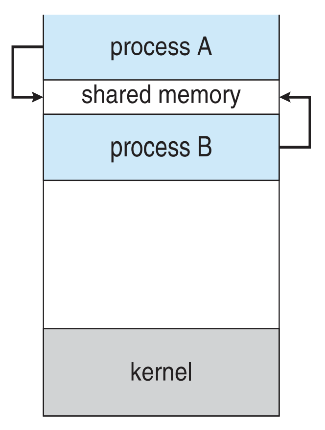
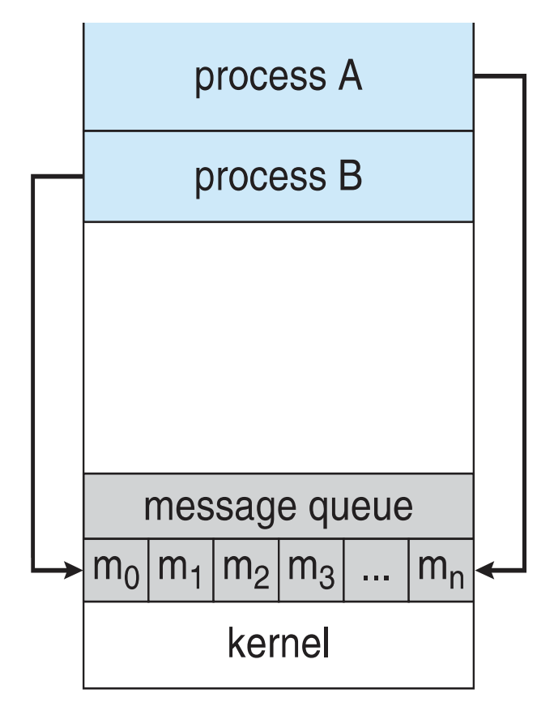

# Quiz 2

---

## Define "program," "process," and "thread," providing a real-world example for each. Elaborate on the reasons for preferring multithreading over multiprocessing.

- **Program**: Passive entity (executable on disk). *Real-world:* a .exe/.out file sitting in Downloads.
- **Process**: Program **in execution** with its own address space and resources (text, PC + registers, stack, data, heap). *Real-world:* two students both open “Word”—that’s **two processes** of the same program.
- **Thread**: The **unit of CPU execution** inside a process; multiple threads = multiple program counters within one address space. *Real-world:* your browser process has UI thread, network thread, renderer threads.

**Why multithreading over multiprocessing:**
- Threads are **lighter**: creation and context switches are cheaper; they **share memory/resources** (no heavy IPC)
- **Multiprocessing** has **higher overhead** (new address spaces, PCBs, heavier context switches, costly communication)

---

## Describe the Process Control Block (PCB) and illustrate the various process states and their transitions using a diagram.

The **PCB** (also called *Task Control Block*) is the OS’s data structure for managing processes. Each process has a PCB that contains:

- **Process State** (running, waiting, etc.)  
- **Process Number — PID** (unique identifier)  
- **Program Counter** (location of next instruction to execute)  
- **CPU Registers** (contents of all process-centric registers)  
- **CPU Scheduling Info** (priorities, scheduling queue pointers)  
- **Memory Management Info** (memory allocated to the process)  
- **Accounting Info** (CPU usage, clock time elapsed since start, time limits, etc)  
- **I/O Status Info** (I/O devices allocated, list of open files)  

**Process States and Transitions:**

  

---

## Describe the Process Control Block (PCB) and illustrate how the Central Processing Unit (CPU) switches from one process to another by explaining the PCB and using a diagram.

See answer above.

**Context Switching:** A context switch occurs when the CPU changes from executing one process to another. To do this safely, the system must **save the state** of the currently running process and later **reload that state** so the process can resume from the exact point it left off.  
- The saved information, known as the **context**, is stored in the **Process Control Block (PCB)**. 

  

---

## Explain Inter-Process Communication (IPC) through both message passing and shared memory methods. Explain direct and indirect message sharing concept using “send” and “receive” functions.

IPC via **message passing** vs **shared memory** (two ways cooperating processes exchange data and information); direct vs indirect (mailboxes) with `send`/`receive`

**Shared Memory**

  

- The OS maps a shared region which (usually exists within the address space of the process that created it) visible to both processes; each reads/writes the region directly
- Fast, but requires synchronization (locks/semaphores) to avoid race conditions
- By default, the OS prevents one process from directly accessing another’s memory. So, shared memory requires mutual agreement between two or more processes to remove this restriction

**Message Passing**

  

- A mechanism that allows processes to communicate and synchronize their actions without sharing the same address space.  
- Good for distributed systems; synchronization can be blocking or non-blocking.

**Direct communication** (name processes):
In direct communication, processes must explicitly name each other:  
- `send(P, message)` → send message to process \(P\)  
- `receive(Q, message)` → receive message from process \(Q\)  

But, if process identifiers change (like a process terminates and restarts with a new PID), all references must be updated. 

**Indirect communication** (via mailbox/port `A`):
In indirect communication, processes do not name each other directly. Instead, they communicate via mailboxes (ports):  
- Each mailbox has a unique ID  
- Processes can send/receive messages only if they share a mailbox  
- `send(A, message)` → send a message to mailbox \(A\)  
- `receive(A, message)` → receive a message from mailbox \(A\)  

---

## Define a pipe in the context of inter-process communication (IPC), and explain how a parent and child process can achieve bi-directional communication using ordinary (anonymous) pipes. Your answer should include why two pipes are necessary, a diagram illustrating the data flow, and the corresponding file descriptors for reading and writing.

A **pipe** acts as a conduit that allows two processes to communicate. They are like files, but unlike files, which are stored permanently on disk, pipes exist in memory (RAM) and vanish when processes finish.  
- If two processes are on the same machine (e.g. `localhost` or `0000`), sockets can be used but are overkill  
- Pipes are faster because communication stays inside the OS memory  

**Example:**
If you run `dir` in Windows, the CLI (parent) process forks a child process to execute `dir`.

We can make use of an **ordinary pipe** that allows communication in a standard producer–consumer style.  

  

So, we can have it set up so:
- The **child process (producer)** writes results to one end of the pipe, the write-only end (file descriptor `fd[1]`)  
- The **parent process (CLI)** reads those results back through the other end, the read-only end (file descriptor `fd[0]`), and then displays the output to the user  

---

## Describe the role of the client-side stub in Remote Procedure Call (RPC). Then, explain the execution steps of an RPC with the help of a suitable diagram.

An **RPC (Remote Procedure Call)** is a protocol that one program can use to request a service from another program on a different computer without needing to understand the network’s underlying details. It abstracts procedure calls between processes on distributed systems, relying on ports to differentiate services and using structured messages instead of raw packets.  

To make this abstraction possible, the **client-side stub** serves as a local proxy for the remote procedure. The stub lets the client invoke a remote function as if it were local by hiding all networking complexities. It takes care of marshalling the procedure name and parameters into a message, sending it to the appropriate server port, and then waiting for the reply. Once the server responds, the stub unmarshalls the return values and delivers them back to the client program seamlessly.  

**Execution Steps of RPC:**

  

1. **Client calls stub**: The user program invokes the procedure \(X\) via the client-side stub, just like a local call
2. **Kernel contacts matchmaker**: The kernel sends a message to the matchmaker (a service) to determine which port the server is listening on for RPC \(X\)  
3. **Matchmaker reply**: The matchmaker replies with the correct port number for that RPC  
4. **Stub sends request**: The client-side stub marshalls the parameters into a message and sends the RPC request to the server daemon listening on that port  
5. **Server stub processes**: The server-side daemon receives the message, unmarshalls the parameters, and invokes the actual procedure on the server  
6. **Server returns result**: The result is marshalled back into a reply message and sent to the client  
7. **Stub delivers output**: The client-side stub receives the reply, unmarshalls it, and returns the output to the client program  

---

## What are the benefits of thread? List the common methods for mapping user threads to kernel threads. List three disadvantages of such mappings.

**Benefits:**
1. **Responsiveness:** Threads provide interactive feedback.

2. **Resource Sharing:** Memory/resources shared by default within a process and so no explicit IPC needed for communication  

3. **Cost Effective:** Less time-consuming to context-switching and creation compared to process creation which is costly due to full memory/resource allocation  

4. **Utilization of Multiprocessor Architectures:** Threads can run in parallel on different CPUs and maximizes throughput on multi-core systems  

**Mapping models:**
- **Many-to-One**: many user threads → one kernel thread (no true parallelism; one blocking system call blocks all)
- **One-to-One**: each user thread → one kernel thread (parallelism; higher creation/management overhead, mitigated by thread pools)
- **Many-to-Many** (+ two-level): many user ↔ many kernel; some user threads can be bound 1:1

**Three disadvantages:**
1. **Blocking problem (M:1)**: a single blocking syscall stalls all user threads.
2. **Overhead/Scalability (1:1)**: creating lots of threads creates lots of kernel objects; higher context-switch and memory cost
3. **Complexity (M:M / two-level)**: scheduler/management is more complex; debugging + correctness harder

---

## Explain two of the key socket functions: socket(), bind(), listen(), accept(), connect(), send(), recv().

- The `socket()` function is the starting point of any network communication. It creates an endpoint for communication and returns a file descriptor that represents the socket. You must specify parameters like the address family (e.g., `AF_INET` for IPv4), socket type (e.g., `SOCK_STREAM` for TCP), and protocol. Without calling `socket()`, no network communication can be initiated.

- The `bind()` function assigns a local address (IP and port) to the socket. This is crucial for server applications that must listen on a specific port so clients know where to connect. If you don’t bind explicitly, the OS may assign a random port, which is usually fine for clients but not for servers. Binding ensures predictability in communication channels.

- Once a socket is bound, `listen()` tells the OS that the socket should be used to accept incoming connections. It also specifies the maximum number of pending connection requests in a queue (the backlog). This is essential for TCP servers because it puts the socket in a passive mode, waiting for clients to connect. Without calling `listen()`, you cannot accept new connections.

- The `accept()` function is called by a server to accept a new incoming client connection. When a client connects, `accept()` returns a new socket descriptor dedicated to that client, while the original socket continues to listen for more connections. This separation allows a server to handle multiple clients concurrently. It is a blocking call by default, waiting until a client connects.

- The `connect()` function is used by a client to establish a connection to a server. You must provide the server’s IP address and port number. If successful, the client’s socket is now connected to the server’s socket, enabling two-way communication. This call blocks until the connection is established or fails.

- The `send()` function is used to transmit data over a connected socket. It takes the socket descriptor, a buffer of data, and its length as arguments. Although it attempts to send all data, in practice it may send fewer bytes, requiring careful handling in production code. It is commonly used in TCP-based applications where reliability of delivery is guaranteed.

- The `recv()` function reads incoming data from a connected socket. Like `send()`, it works with a buffer and size parameter, returning the actual number of bytes received. It blocks until data arrives unless the socket is set to non-blocking mode. This function is central to receiving messages or streams of data from a peer.