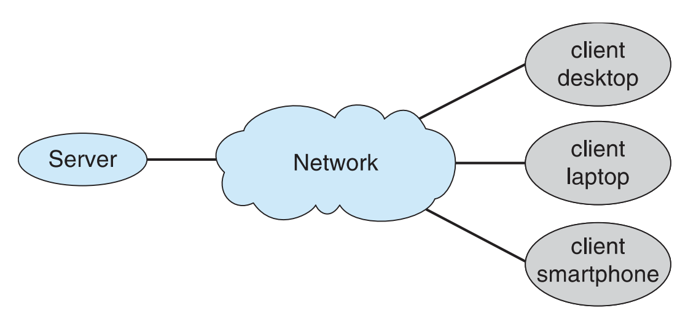

# What is an Operating System?
An **Operating System (OS)** is a program that acts as an intermediary between the user and the computer hardware.  
- Without the OS, users would have to directly control hardware like the CPU, memory, and disk (which is impractical)  
- The OS hides the hardware complexity and provides a friendlier interface  

**Goals of an Operating System:**
1. Execute user programs and make solving user problems easier  
2. Make the computer system convenient to use  
3. Use the computer hardware in an efficient manner  

**What Operating Systems Do:**
The role of an operating system depends on the point of view:
- **From the user’s point of view:**  
  - Users want convenience, ease of use, and good performance  
  - They usually don’t care about resource utilization (how efficiently hardware is used)  

- **From the system’s point of view:**  
  - For shared computers (e.g., mainframes or minicomputers), the OS must keep all users happy by fairly sharing resources  
  - For dedicated systems (e.g., workstations), users may have dedicated resources but still share others (like servers)  
  - For handheld systems, the OS must deal with limited resources, focusing on usability and battery life  
  - For embedded computers (e.g., cars, appliances), the OS may have little or no user interface and runs silently in the background  

---

# Computer System Structure

  

A computer system can be viewed as consisting of four major components:

1. **Hardware** – Provides basic computing resources  
   - CPU (processing power)  
   - Memory (temporary storage for running programs)  
   - I/O devices (keyboards, monitors, printers, network cards)  

2. **Operating System** – Controls and coordinates the use of hardware among applications and users  

3. **Application Programs** – Define how users solve their problems using system resources  
   - Examples: Word processors, compilers, web browsers, database systems, video games  

4. **Users** – People, machines, or other computers interacting with the system  

---

# Operating System Definition
## OS as a Resource Allocator
The operating system manages all the computer’s resources.  
- Ensures efficient and fair use of CPU, memory, and I/O devices  
- Decides between **conflicting requests** from different programs or users  
- Example: If two programs both want to use the printer, the OS decides who goes first  

## OS as a Control Program
The operating system also controls the (safe and proper) **execution** of programs.  
- Prevents errors, such as one program accidentally overwriting another’s memory  
- Protects against improper use of the computer, whether intentional (malware) or accidental  

## Exact Definition?
There isn’t one strict definition of an OS. Some useful approximations include:
- “Everything a vendor ships when you order an operating system”  
- “The one program running at all times on the computer” — this is called the **kernel**  

Everything else is either: 
- **System programs**: Utilities that come with the OS (file managers, shells, etc)  
- **Application programs**: User-installed software  

---

# Computer Startup

When a computer powers on, the operating system isn’t running yet. Instead:

- A **bootstrap program** is loaded (at power-up or reboot)  
    - Stored in **firmware** i.e. ROM (Read-Only Memory) or EPROM  
    - Initializes system hardware and loads the OS kernel into memory  
    - OS begins execution and takes control  
    
> The bootstrap program is stored in **non-volatile, read-only memory**, meaning it cannot be altered during normal operation and protects it from malware.  

---

# Computer System Organization & Operation

A computer system is built from several parts connected through a **common bus**:

- One or more **CPUs** coordinate execution  
- **Device Controllers** are responsible for managing a specific type of device and have a **local buffer** to hold temporary data  
  - Disk controller → Disks  
  - USB controller → Mouse, keyboard, printer  
  - Graphics adapter → Monitor  
- **Devices** – The actual hardware used for **input and output**, storage, and display 
- **Shared memory** is the central communication channel between CPU and devices   

**How they work together:**
- CPU and I/O devices can execute **concurrently**  
- The CPU moves data between main memory and these local buffers  
- Once a device completes its task, it (the controller) signals the CPU via an **interrupt** 

  

## Interrupts
Interrupts are the OS’s way of **reacting to events** rather than constantly checking devices. When an interrupt occurs, it transfers control to the appropriate **interrupt service routine** through the **interrupt vector**, which is a table storing the addresses of all service routines. Before handling the interrupt, the CPU must first **save the address of the interrupted instruction** so it can resume the program later.  

In addition to hardware-generated interrupts (from devices), the OS also handles **software-generated interrupts**, called **traps** or **exceptions**. These occur when errors happen (e.g., divide by zero) or when a program explicitly requests OS services.  

Because of this design, an operating system is said to be **interrupt driven** — it waits for events to occur and responds only when necessary.  

### Interrupt Handling
Since the OS is **interrupt driven**, it must manage the CPU carefully whenever an interrupt occurs. The CPU first **saves its state** — this means storing the contents of **registers** (the CPU’s small, very fast storage locations) and the **program counter** (which records the address of the next instruction to execute). This ensures the interrupted process can later resume exactly where it left off.  

Next, the OS determines **what caused the interrupt**:  
   - **Polling**: CPU checks devices one by one  
   - **Vectored interrupts**: Device provides a number that directly indexes into the interrupt vector  

Once identified, the CPU runs the **appropriate handler routine** to deal with the event.  

### Interrupt Timeline

  

- CPU executes a **user process**  
- An I/O device (like a disk) becomes **active**, meaning it is busy transferring data.  
- Once the transfer is complete, the device controller interrupts the CPU  
- CPU briefly pauses the user process to handle the interrupt, then resumes  

### I/O Structure
Building on interrupts, we can now see how input/output (I/O) operations are handled. When a program requests I/O, the CPU and OS can deal with it in two ways:

**1. Blocking I/O (synchronous)**
- The user program **waits until the I/O is finished** before continuing  
- This waiting can be inefficient:  
  - A **wait instruction** leaves the CPU idle until the next interrupt  
  - A **wait loop** repeatedly checks device status, wasting CPU cycles  
- At most one I/O request can be outstanding, so no overlapping I/O work occurs  
- **Example:** A text editor saves a file to disk and cannot accept more typing until the save completes.

**2. Non-blocking I/O (asynchronous)**
- After starting I/O, control immediately returns to the user program  
- The program continues executing while the device works in the background  
- The OS provides mechanisms for tracking completion:  
  - **System call** – program explicitly request OS to wait  
  - **Device-status table** – the OS maintains a table with each device’s type, address, and current state  
    - When an I/O finishes, the OS updates this table and uses interrupts to notify the CPU  
- **Example:** A web browser fetches an image from the network while still letting you scroll the page or type in the search bar 

---

# Storage  

## Storage Definitions and Notation

The basic unit of storage in a computer is the **bit**, which can hold one of two values: 0 or 1.  
- Collections of bits represent all data: numbers, letters, images, sounds, videos, and programs  
- A **byte** = 8 bits, and is usually the smallest convenient unit of storage  
- A **word** is a larger unit defined by the computer’s architecture (often 4 or 8 bytes)  
  - Example: A 64-bit system typically has 8-byte words  

Computer storage and throughput are measured in collections of bytes:  
- **KB (kilobyte)** = $1024$ bytes  
- **MB (megabyte)** = $1024^2$ bytes  
- **GB (gigabyte)** = $1024^3$ bytes  
- **TB (terabyte)** = $1024^4$ bytes  
- **PB (petabyte)** = $1024^5$ bytes  

> Note: Manufacturers often round these (1 MB = 1 million bytes), but networking sticks to bits since data moves one bit at a time  

## Storage Structure
Storage comes in several layers depending on speed and permanence:

**Main Memory (RAM)**  
- This is the only large storage that the CPU can access **directly** without going through controllers  
- It’s called **random access** because the CPU can jump to any memory location instantly, rather than reading in order (like from a tape or disk)  
- RAM is **volatile** so when power is lost, all data disappears which is why programs and files must be saved to permanent storage  

**Secondary Storage**  
- Because RAM is limited and temporary, we need much larger, **nonvolatile** storage that persists even when power is off  
- **Hard Disks (HDDs)**  
    - Traditional hard drives store data on rigid metal/glass  **platters** coated with magnetic material. The surface is divided into **tracks** (concentric circles) and further into **sectors** (the smallest storage unit).  
    - A mechanical arm with read/write heads moves to the right track and sector to access data.  
    - This makes HDDs relatively **slow**, since physical movement is required. The **disk controller** sits between the CPU and the disk, managing this low-level positioning and data transfer.  
- **Solid-State Disks (SSDs)**  
    - SSDs replace moving platters with **flash memory** (electronic circuits that retain data without power).  
    - Because they have **no moving parts**, they are much faster and more durable than HDDs.  
    - They have quickly become the standard for laptops, desktops, and servers, though they are more expensive per gigabyte compared to hard disks.  

## Storage Hierarchy
Storage is organized in a **hierarchy** based on three trade-offs:  
- **Speed** (faster → slower)  
- **Cost** (more expensive → cheaper)  
- **Volatility** (volatile → nonvolatile)  

Other key concepts:  
- **Caching**: Copying data into faster storage to speed up access (e.g., RAM acts as a cache for disk)
- **Device Drivers**: Software that manages each device controller, providing a standard interface for the OS  

The full hierarchy can be visualized as layers, from fastest/smallest to slowest/largest:  

  

1. **Registers** (inside CPU – fastest, smallest)  
2. **Cache** (small, very fast memory close to CPU)  
3. **Main memory (RAM)**  
4. **Solid-state disks (SSDs)**  
5. **Hard disks (HDDs)**  
6. **Optical disks** (CD/DVD/Blu-ray)  
7. **Magnetic tapes** (slowest, used for backups/archives)  

> Higher in the hierarchy = faster and costlier, but smaller. Lower in the hierarchy = slower and cheaper, but larger.  

## Caching
A fundamental principle of computer systems is **caching** which is keeping data that is in use in a faster, smaller storage so it can be accessed quickly.  

When a program needs information, the system first checks the **cache** (fast storage).  
- If the data is found there (a **cache hit**), it is used immediately, which is much faster  
- If it is not present (a **cache miss**), the data is copied from slower storage (like RAM or disk) into the cache and then accessed  

Caches are always **smaller** than the storage they accelerate which makes **cache management** crucial. The OS and hardware must decide:  
- **What size** the cache should be  
- **Which data to replace** when the cache is full (replacement policies e.g., Least Recently Used)  

> Note: Caching is not limited to hardware. It happens at many levels: CPU registers, operating system buffers, and applications (like a web browser caching images).  

## Direct Memory Access (DMA)
For high-speed I/O devices (like disks or network cards), involving the CPU in every single data transfer would be too slow. This is where **Direct Memory Access (DMA)** comes in.  

Instead of the CPU moving every byte between device and memory, the **device controller** transfers large blocks of data **directly into main memory**.  
- The CPU is only interrupted once per block (when the transfer is complete), rather than once per byte  
- This dramatically reduces CPU overhead and allows I/O devices to operate **close to memory speeds**  

In essence, DMA allows the CPU to **delegate** repetitive data transfer work, freeing it to focus on running user programs while I/O happens in the background.  

---

# Computer-System Architecture

## Von Neumann Model (How a Modern Computer Works)

  

  

Modern computers follow the **von Neumann architecture** where a CPU, memory, and I/O devices interact through well-defined cycles:  

- The **CPU** executes instructions and manipulates data, often using a **cache** to speed up repeated access  
- **Memory** holds both instructions and data, which the CPU fetches during the execution cycle  
- **Devices** (storage, printers, network cards, etc.) communicate with the CPU through:  
  - **I/O requests** – the CPU asks a device to perform an operation  
  - **Data transfers** – devices send or receive data  
  - **Interrupts** – devices signal the CPU when a task is done  
- For high-speed devices, **Direct Memory Access (DMA)** allows the device to bypass the CPU and transfer data directly into memory, reducing overhead  

## Processor Systems 
Most systems start with a **single general-purpose processor (CPU)**, but modern designs often expand beyond this:  
- **Special-purpose processors** (e.g., GPUs, network processors) handle specialized workloads  
- **Multiprocessor systems** — also called **parallel systems** or **tightly-coupled systems** — involve multiple CPUs working together  
  - **Advantages**:  
    1. **Increased throughput** – more tasks processed in parallel  
    2. **Economy of scale** – adding processors is cheaper than building independent machines  
    3. **Improved reliability** – even if one CPU fails, others can continue (fault tolerance)  
  > *Note,* even if we have a multiprocessing architecture, we can't multitask if some tasks are blocking.

### Types of Multiprocessing  
1. **Asymmetric Multiprocessing (AMP)** – each processor is assigned a specific role (e.g., one master, others as workers).

2. **Symmetric Multiprocessing (SMP)** – all processors are peers and share the same tasks, improving load balancing.  

  

  

#### A Dual-Core Design  
A practical evolution of SMP is the **multicore processor**:  
- A single chip contains multiple **cores** (essentially mini-CPUs), each with its own registers and cache  
- These cores share the same memory but operate independently, allowing for parallel execution on a much smaller footprint  
- This design improves performance and energy efficiency since communication between cores is faster than between separate CPUs  

  

  

## Clustered Systems  
While multiprocessor systems put multiple CPUs in a single machine, **clustered systems** connect multiple independent computers so they work together as if they were one. These systems are often linked through a **storage-area network (SAN)**, allowing them to share the same data.  

The primary motivation for clustering is **high availability**. If one machine fails, others can take over and keep the system running. Clustering can also provide performance benefits, especially in **high-performance computing (HPC)** where large problems are broken down and solved in parallel.  

### Types of Clustering  
1. **Asymmetric Clustering** – one machine runs applications while another sits in **hot-standby mode**, ready to take over if the active machine fails.  
2. **Symmetric Clustering** – multiple machines actively run applications and monitor each other, sharing the workload and improving reliability.  

### Characteristics  
- **High-performance clusters** require applications to be written with **parallelization** in mind so work can be spread across nodes  
- Some clusters use a **distributed lock manager (DLM)** to prevent conflicts when multiple machines try to access the same resource at once  

  

  

---

# Operating System Structure  

## Multiprogramming (Batch Systems)  
Early computers were very inefficient. A single user’s program could not keep both the CPU and I/O devices busy all the time. For example, if a program was waiting for disk input, the CPU would simply sit idle.  

**Multiprogramming** solved this by organizing multiple jobs (code and data) in memory at once.  
- A **subset of total jobs** is always kept in memory  
- The OS uses a **job scheduler** to select which job to run on the CPU (based on some priority)  
- If the running job has to wait for I/O, the OS switches to another job, ensuring the CPU is always doing useful work. Othewrise, it will only perform one job at a time.  

This system was efficient because it maximized CPU utilization, but it was still a **batch-oriented approach**. Users submitted jobs and waited for output later, without direct interaction.

  

  

**Example:** 
Suppose a system has three jobs loaded into memory:  
- **Job A**: compiling a program (CPU-intensive)  
- **Job B**: reading a large file from disk (I/O-intensive)  
- **Job C**: compressing data (CPU + I/O)  

When Job B is waiting for disk I/O, the OS switches the CPU to run Job A or Job C.

## Timesharing (Multitasking)  
Timesharing extended multiprogramming by making systems **interactive**. Instead of only improving efficiency, the goal was to let multiple users interact with their programs **simultaneously**.  

Here’s how it worked:  
- The CPU’s time is divided into **tiny slices** (milliseconds)  
- Jobs are switched so quickly that each user feels as if their program is running alone on the machine  
- The OS ensures **response time < 1 second**, so user input/output feels immediate  
- Each user’s running program is called a **process** and the OS uses **CPU scheduling** to decide which process runs next  

If memory fills up, the OS uses:  
- **Swapping** – moving processes in and out of memory to keep things running  
- **Virtual memory** – allowing processes to run even if they don’t fully fit into physical memory, giving the illusion of larger memory space  

**Example:**
On a modern laptop with multiple users logged in:  
- **User 1** is editing a document in Word.  
- **User 2** is running a Python script.  
- **User 3** is streaming music.  

The CPU slices time into milliseconds and rapidly switches between these processes. Each user experiences smooth performance - Word responds to keystrokes immediately, the script continues to run, and the music plays without interruption.  

If memory is full, the OS may **swap** the Python script out to disk temporarily while keeping Word and the music player active in memory. **Virtual memory** ensures that all three appear to have sufficient memory, even if physical RAM is smaller.  

  

  

## Operating System Operations  

An OS is fundamentally **interrupt-driven**. Instead of constantly checking devices or programs, the CPU executes user code until an **event/interrupt** occurs at which point the OS is called into action.    
- **Hardware Interrupts:** triggered by devices (e.g., disk completed I/O)  
- **Software Interrupts (traps or exceptions):**  
  - Errors (e.g., divide by zero)  
  - Explicit requests for OS services (system calls)  
  - Protection errors (infinite loop, illegal access)  

But when the OS takes control, how do we ensure it remains protected from other user programs? The answer is **dual-mode execution**.  
- **User mode** is where applications run. Programs have restricted privileges, meaning they cannot directly access hardware or execute dangerous instructions.  
- **Kernel mode** is for executing OS code with full privileges over the CPU, memory, and I/O devices.  

Note: A **mode bit** (provided by the hardware) distinguishes the two. Some instructions are **privileged** (only run in kernel mode). System calls switch the CPU to kernel mode, then return back to user mode.  

Modern CPUs even support **multi-mode** operations (e.g virtualization with a **virtual machine manager (VMM)**).  

### Transition from User to Kernel Mode  
- The OS uses a **timer** to prevent infinite loops or processes hogging resources 
- A counter decrements with the system clock; when it reaches zero, an **interrupt** occurs
- This ensures the OS can regain control and schedule fairly

  

  

## Process Management  

At the heart of an OS is the idea of a **process**.  
- A **program** on disk is just passive code waiting until something runs it  
- A **process** is that program in execution: an *active entity* that has code and data (state)  
    - Every process needs resources (CPU time, memory, I/O devices, files, Initialization data) to accomplish its task

Some processes are **single-threaded** (one **program counter** specifying the location of the next instruction to execute). Others are **multi-threaded**, with multiple program counters (one per thread), representing a separate sequence of execution inside the same process.  

At any given moment, the OS must keep track of many processes. Since there are usually more processes than CPUs, the OS **multiplexes** the CPU i.e. rapidly switching between them to give the illusion that they run in parallel.  

### Why Process Management Matters  

This is where the OS’s dual role becomes clear:  
- **As a resource allocator**, it decides which process gets the CPU, memory, or I/O next.  
- **As a control program**, it ensures processes don’t interfere with one another — preventing errors or malicious behavior.  

### Process Management Activities  

To achieve this, the OS is responsible for providing these set of core operations:  
- Creating and deleting both user and system processes
- Suspending and resuming processes  
- Providing mechanisms for process synchronization
- Providing mechanisms for process communication
- Handling **deadlocks** when processes compete for resources  

## Memory Management  

For a program to execute, **its instructions and data must be in memory**. The OS is responsible for managing this memory and deciding: 
- What is in memory? 
- When it is there? 
- How much each process can use?  

The **goal** is to keep the CPU busy and the system responsive. If memory is poorly managed, the CPU could sit idle waiting for data, or processes could overwrite each other leading to errors.  

### Memory Management Activities   
- The OS keeps track (via a table) of which regions of memory are in use and by which whom  
- The OS decides which processes (or parts thereof) and data to move into and out of memory
- The OS must allocate processes memory when requested and deallocate it when they finish  

> In short, memory management is about giving each process the **illusion of a large, private workspace**, while in reality carefully sharing a limited physical resource among many processes.

## Storage Management  

The OS provides a **uniform, logical view of storage** even though physical devices differ.  
- Abstracts physical properties into a **logical unit (file)**.  
- Each medium (disk, SSD, tape) has different properties: speed, capacity, access method.  

### File-System Management  
The OS organizes and controls file storage:  
- Organizes files into **directories**.  
- Enforces **access control** (who can access what).  
- Provides operations such as:  
  - Creating and deleting files and directories.  
  - Manipulating file contents.  
  - Mapping files to secondary storage.  
  - Backing up files to stable, nonvolatile media.  

## I/O System Management  

OS also manages I/O devices and controllers:  
- Provides a **buffering and caching** layer to improve performance.  
- Uses **device drivers** to provide a uniform interface between hardware devices and the kernel.  
- Ensures coordination of concurrent I/O operations.  

## Storage Management  

Memory is fast but limited so most data lives on **secondary storage**. The OS provides a **uniform, logical view** of all these devices so that users and applications don’t need to worry about the messy physical details.  
- At the logical level, everything is represented as a **file**. 
- Physically, devices differ in speed, capacity, transfer rates, and access methods (sequential or random). The OS abstracts away these differences and presents a consistent interface so programs can work with data the same way no matter where it is stored.  

### File-System Management  
To make storage usable, the OS implements a **file system**:  
- Files are organized into **directories** so users can navigate and manage data hierarchically  
- **Access control** enforces security, determining who can read, write, or execute what 

### Storage Activities
The OS provides essential operations:  
  - Creating and deleting files and directories  
  - Manipulating file contents (read, write, update)  
  - Mapping files to the actual blocks of secondary storage  
  - Backing up files to stable, **nonvolatile media** so data survives failures  

## Mass-Storage Management  
Again, most data cannot fit into main memory or must be kept for long periods of time, so they resides on secondary storage media. Managing this mass storage is critical for the performance of the entire computer system.  

### Mass Storage Activities   
- **Free-space management** – tracking which parts of the disk are unused and available for allocation  
- **Storage allocation** – deciding how files and data blocks are laid out on disk  
- **Disk scheduling** – ordering read/write requests to maximize throughput and minimize seek/rotation delays  

### Not All Storage Needs to Be Fast  

**Tertiary Storage** comes in as optical media (CDs, DVDs), magnetic tapes, etc. These media are slower to access and sometimes even require manual intervention but are far cheaper per gigabyte and can safely hold data for years. 
- They are often used for backups and archival storage.  

The OS must still manage this storage carefully even if it isn’t part of day-to-day operations. 

Tertiary media also come in different flavors:  
- **WORM (Write-Once, Read-Many)** – good for legal or compliance data where immutability is required (e.g., medical records on CD-R)  
- **RW (Read-Write)** – allows overwriting, like rewritable DVDs or tapes, making them more flexible but also less permanent  

## Performance of Various Storage Levels  

Storage is organized in a **hierarchy**, balancing speed, size, and cost.  

| Level | Name           | Typical Size | Access Time (ns) | Managed By     | Backed By |
|-------|----------------|--------------|------------------|----------------|-----------|
| 1     | Registers      | < 1 KB       | 0.25 – 0.5       | Compiler       | Cache     |
| 2     | Cache          | < 16 MB      | 0.5 – 25         | Hardware       | Main Memory |
| 3     | Main Memory    | < 64 GB      | 80 – 250         | OS             | Disk      |
| 4     | Solid-State Disk | < 1 TB     | 25,000 – 50,000  | OS             | Disk      |
| 5     | Magnetic Disk  | < 10 TB      | 5,000,000        | OS             | Disk/Tape |

- Movement between levels can be **explicit** (program decides) or **implicit** (hardware/OS decides automatically)  

## Migration of Data in the Storage Hierarchy  

Efficient execution depends on **data migration** between storage levels. The CPU can only operate on what’s in its registers, but most data originates from disk. The journey looks like this:  

  

  

Value `A` loaded from disk → main memory → cache → CPU registers.  
- The most recent copy must always be used, regardless of where it resides  
- In **multiprocessor environments**, hardware enforces **cache coherency** so all CPUs see the latest value  
- In **distributed environments**, multiple copies may exist across machines, requires more complex solutions 

## I/O Subsystem  

One of the OS’s most important jobs is to manage **I/O devices**, hiding their peculiarities and complexities from users.  

### Responsibilities  
- **Memory Management of I/O:**  
  - **Buffering** – temporarily holding data while it is being transferred  
  - **Caching** – storing frequently accessed data in faster storage  
  - **Spooling** – overlapping the output of one job with the input of other jobs

- **Device-driver Interface**  
  - The OS provides a **general device-driver interface** so applications don’t need to know device details  
  - Each device has a specific **driver** that translates generic requests into hardware-specific commands  

## Protection and Security  

Every OS must prevent chaos: processes competing for resources, users interfering with each other, and attackers trying to exploit the system. 

**Protection** is any mechanism for **controlling access** to resources. It defines _who can do what_.  

**Security** is broader: it is the **defense of the system** against internal and external threats.  
- Covers denial-of-service attacks, viruses, worms, identity theft, theft of service, etc  
- Security builds **on top of protection**. If the OS doesn’t enforce proper access rules, then attackers can easily exploit it  

### How Systems Enforce Protection & Security  
To enforce these policies, the OS first needs to **distinguish between users**:  

- **User IDs, Security IDs:** Each user has a unique identifier associated with all processes and files owned by that user. This determines what actions a user can perform (read/write/execute).  

- **Group ID:** Allows set of users to be defined and permissions can then be granted to a group rather than just an individual.  

- **Privilege Escalation:** Allows a user or process to temporarily gain more rights. This must be tightly controlled.  

## Kernel Data Structures  

Again, the OS kernel is the one program that is always running. It remains in memory at all times and orchestrates everything else on the system. **Data structures are the backbone** of it. 

### Linked Lists  
The kernel needs to maintain dynamic collections of objects (like processes, file descriptors, or memory blocks). Linked lists are lightweight and flexible for this purpose.  

- **Singly Linked List**: Each node has data and a pointer to the next node. Used for simple, fast append/iterate operations.  
  - In the kernel, it’s used for simple queues and tracking free memory blocks

  

    
  
  

- **Doubly Linked List**: Each node points both forward and backward making insertions and deletions faster when traversing in both directions. Used extensively in Linux for process lists and device queues. 
  - In the kernel, it’s used for process lists and device I/O queues

  

    
  
  

- **Circular Linked List**: Last node points back to the first, forming a cycle. 
  - In the kernel, it's used for **round-robin scheduling** where the CPU cycles through processes in a loop.  

  

    
  
  

### Trees  
Some operations require fast searching, insertion, and deletion. Trees provide a more structured way to organize data.  

- **Binary Search Tree (BST)**: Ensures left child ≤ parent ≤ right child. Search performance is $O(n)$ in the worst case.  

- **Balanced Binary Search Tree**: Keeps tree height logarithmic, improving search to $O(\log n)$. 
  - In the kernel, it's used as **red-black trees** for process scheduling and memory region tracking  

  

    
  
  

### Hashing and Bitmaps  
For even faster lookups, the kernel often uses **hash tables**.  

- **Hash Map**: A **hash function** maps a key to a bucket index. Perfect for quick access to inodes in a file system or process IDs.  
  - In the kernel, it's used for process ID lookups, inode caching in file systems, network connection tracking
  

    
  
  

- **Bitmap**: An array of bits where each bit tracks the status of a resource (0 = free, 1 = used). It is Extremely efficient for memory allocation and free-space tracking in disks.
  - In the kernel, it’s used for free-space management in file systems and page allocation tracking  

---
# Computing Environments  

The OS must adapt to the context in which computing happens as different environments have different requirements. Below are the main models.  

## Traditional Computing  
Early systems were **stand-alone general-purpose machines** e.g. desktops, minicomputers, mainframes.  
- The OS’s job was simple: keep the CPU and devices busy, protect memory, and manage files.  
- But as networking became ubiquitous, the “stand-alone” model blurred. Today, even a home PC is tied to larger ecosystems.  

Key OS adaptations here:  
- **Portals**: Provides web access/interfaces to internal systems. 
- **Network Computers (Thin Clients)**: Lightweight devices that offload computation to servers.   
- **Wireless Networking**: The OS integrates drivers, TCP/IP stacks, and mobility support so laptops can interconnect between networks.  
- **Security (Firewalls)**: The OS acts as a _gatekeeper_ inspecting and filtering traffic to protect the local system from the Internet.  

## Mobile Computing  
Smartphones and tablets are not just “small laptops.” They reshaped OS responsibilities:  
- They require **sensor integration** (GPS, accelerometer, gyroscope) so apps can leverage location, orientation, and movement.  
- They demand **battery-aware scheduling and memory management** as energy is the scarcest resource.  
- They introduced **new app models** (augmented reality, real-time navigation) that depend on real-time access to both hardware and the network.  

## Distributed Computing  
A distributed system is a **collection of separate, possibly heterogeneous, systems**  networked together. The OS here must extend beyond a single machine to support **network transparency** and processes should communicate and share resources as if they were local.  

The key to making this work is the **network** usually built on TCP/IP. Depending on scale, networks fall into different categories:  
- **LAN (Local Area Network):** Connects systems in the same building or campus  
- **WAN (Wide Area Network):** Connects systems across cities, countries, or globally (the Internet)  
- **MAN (Metropolitan Area Network):** Intermediate scale e.g. across a city  
- **PAN (Personal Area Network):** Very small scale e.g. Bluetooth devices around a person  

On top of this, a **Network Operating System** extends OS services across multiple machines:  
- Provides a **communication scheme** so processes on different nodes can exchange messages reliably  
- Creates the **illusion of a single unified system**, even though it is physically distributed  

### Client–Server Computing  
This model reshaped traditional computing by replacing “dumb terminals” with intelligent devices that could request services from more powerful central machines.  
- **Clients:** User-facing systems that run applications but rely on servers for heavy lifting.  
- **Servers:** Centralized systems that respond to client requests, often optimized for performance, reliability, and scalability.  

Two dominant patterns exist:  
1. **Compute-Server System:** Provides an interface to a clients to request services (i.e., database).  
2. **File-Server Systems:** Provides an interface to clients to read/write/store data. The server manages the filesystem.  

**Example:** A corporate network where employees use laptops (clients) to query a shared database (compute server) and store documents on a central file server.

  

  

### Peer-to-Peer (P2P) Computing  
P2P does not distinguish clients and servers – each can act as client or server depending on the situation. 
- All nodes are considered **peers**
- To join, a node must connect to the P2P network and advertise its presence via:  
  - A **central lookup service**   
  - Or a fully decentralized **discovery protocol**, where peers broadcast and respond to service requests dynamically  

- The OS here must support **dynamic discovery** of peers, handle **decentralized communication**, and enforce **fair resource sharing**  
- The challenge is consistency: multiple copies of data may exist, so the OS (or middleware above it) must ensure synchronization and trust  

Examples:  
- File-sharing (Napster, Gnutella)  
- Communication (Skype, VoIP)  
- Even modern blockchain systems adopt P2P principles.  

  

  

## Virtualization  

Up to now, we’ve treated the OS as a single manager that arbitrates between **users, processes, and hardware** on *one* machine. But modern computing often requires the ability to run **multiple operating systems on the same physical hardware** as if each had the machine to itself. This is the essence of **virtualization**.  

### Emulation vs Virtualization  
- **Emulation**: When the guest OS is built for a different CPU architecture than the host, every instruction must slowly be translated for cross-platform compatibility.  
- **Virtualization**: When the guest OS is compiled for the same CPU architecture as the host. Here, the OS doesn’t need to translate every instruction and instead, a **Virtual Machine Manager** or better known as a **hypervisor** sits between hardware and guests, intercepting privileged operations and mapping them safely to real hardware.  

In other words, emulation is about *pretending* different hardware exists, while virtualization is about *slicing up* the real hardware so multiple OSes can share it efficiently.  

### Use Cases  
- Run multiple OSes on a single laptop/desktop  
  - Example: Apple laptop with **Mac OS X as host**, Windows running as a **guest**  
- Developers can build and test apps for multiple OSes without needing multiple physical systems  
- Run different OS configurations on the same hardware for validation.  
- Execute and manage many isolated compute environments efficiently within data centers

### Visual Model

  

  

- (a) **Traditional System**: Hardware → Kernel → Processes  
- (b) **Virtualized System**: Hardware → VMM → Multiple Guest Kernels → Processes  

One guest cannot interfere with another but they can run side by side.  

## Cloud Computing  

Cloud computing is the **logical extension of virtualization**. If virtualization lets a single machine host multiple OSes, cloud computing scales that idea to thousands of machines, pooling compute, storage, and networking resources and exposing them “as a service” over the Internet.  

- **Public Cloud**: Open to anyone willing to pay (e.g. AWS, Azure, GCP)  
- **Private Cloud**: Built and managed internally for a single organization  
- **Hybrid Cloud**: Mix of public and private resources, often for cost/security trade-offs  

Cloud providers deliver resources in service layers:  
- **IaaS (Infrastructure as a Service):** Raw servers or compute/storage/networking available over the Internet (e.g. Amazon EC2)  
- **PaaS (Platform as a Service):** Software stack ready for application use via the Internet like managed databases or app servers  
- **SaaS (Software as a Service):** Fully managed applications delivered over the web (e.g. Google Docs, Office 365)  

The OS role here is no longer tied to a single machine — it is to **coordinate VMs and containers at scale**.  

### Cloud System Architecture  

  

  

1. **Internet:** Users send requests (start a VM, store a file, etc)  
2. **Firewall:** Filters traffic, blocks malicious requests  
3. **Load Balancer:** Spreads requests across many servers so no single one gets overloaded  
4. **Cloud Customer Interface:** Where the user interacts (AWS console, API, web portal)  
5. **Cloud Management Services:** Interprets commands and manages resources (VMs, storage)  
6. **Servers & Virtual Machines:** Actual compute power; VMs run applications  
7. **Storage:** Persistent data storage, accessible from anywhere  

## Real-Time Embedded Systems  

The most common computers in the world are not desktops or servers but **embedded systems**. They are the small computers built into cars, appliances, medical devices, and industrial controllers.    
- Vary considerably and **special-purpose** 
- Limited purpose OS and resource-constrained (limited memory, CPU)  
- Many run on a **Real-Time OS** which is a stripped-down OS designed for strict timing guarantees  

### Real-Time Constraints  
A real-time OS is only considered *correct* if tasks are completed **within strict timing limits**:  
- **Hard Real-Time:** Missing a deadline = system failure (e.g. pacemaker delivering a heartbeat signal)  
- **Soft Real-Time:** Occasional deadline misses are tolerable but undesirable (e.g. video playback dropping frames)  

