# Process Concept
The operating system executes a variety of programs:  
- **Batch systems** run *jobs* submitted by users  
- **Time-shared Systems** run *user programs (tasks)*, allowing multiple users to interact with the system simultaneously  

> Textbooks often use **job** and **process** interchangeably, but in modern OS theory, a **process** specifically means *a program in execution*.

A process consists of several parts:  
- **Text Section:** The program code itself  
- **Program Counter & Registers:** Track the current execution state  
- **Stack:** Temporary data such as function parameters, return addresses, local variables  
- **Data Section:** Global variables  
- **Heap:** Contains memory dynamically allocated at runtime  

---

<p align="center">
  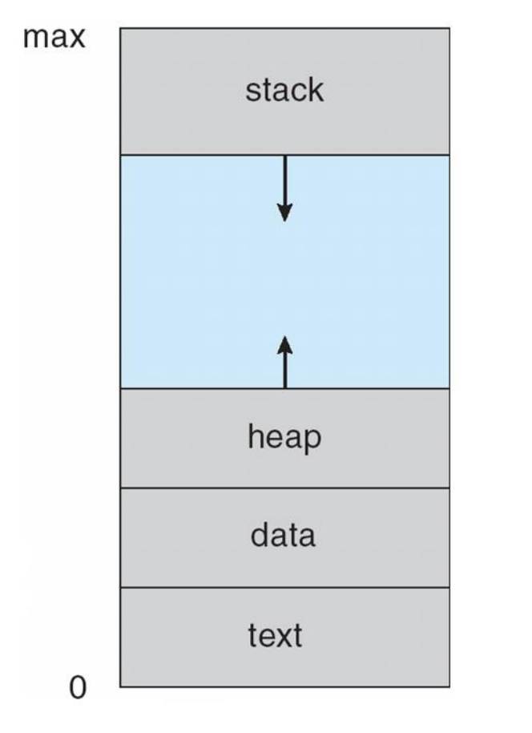
</p>

# Program vs Process
- A **program** is a passive entity (an executable file) stored on disk.  
- A **process** is an active entity, created when the program is loaded into memory.  
  - *Important:* Multiple processes may be created from a single program (e.g. multiple users running the same program)

Execution can begin through:  
- GUI actions (mouse click, double-click)  
- CLI commands (typing program name)  

---

# Threads
A **thread*** is the unit of execution within a process.
- Traditionally, each process has **one program counter**, meaning only one sequence of instructions could execute at a time.  
- By introducing **multiple program counters**, different parts of the process can run simultaneously.  
- These **multiple threads of control** are called **threads**.  

<p align="center">
  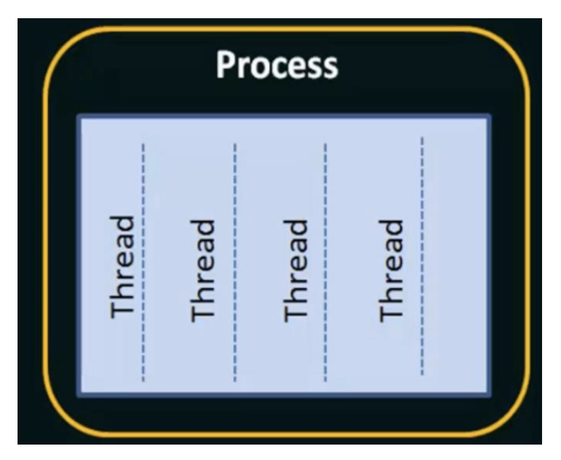
</p>

*Note:* More to be discussed next section/chapter.

---

# Example: Program, Process, Threads

<p align="center">
  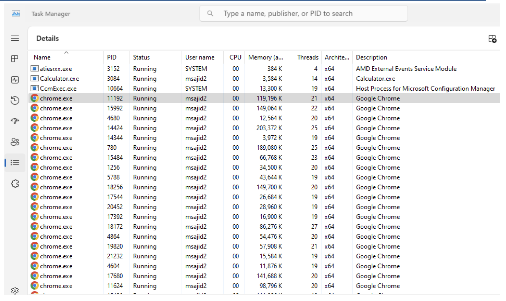
</p>

---

# Process State
As a process executes, it transitions between states:

<p align="center">
  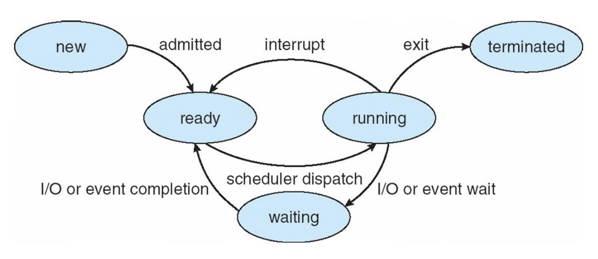
</p>

A process begins in the **New** state, where it is created but not yet admitted. Once ALL resources are allocated, it enters the **Ready** state, waiting for CPU time.  

When scheduled, it moves to **Running**, where instructions execute on the CPU. From here, it may:  
- Return to **Ready** if preempted.  
- If it issues an I/O or some event, it transitions to **Waiting**. Once the I/O or event completes, the process does not resume running and instead goes back to the **Ready**, since another process may currently occupy the CPU. The scheduler would decide when it runs again based on some priority.  
- All processes eventually finish and transition to **Terminated** where the OS reclaims resourecs.  

---

# Process Control Block (PCB)

The **PCB** (also called *Task Control Block*) is the OS’s data structure for managing processes. Each process has a PCB that contains:

<p align="center">
  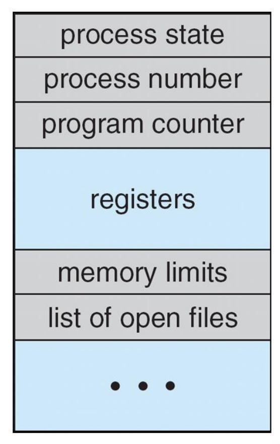
</p>

- **Process State** (running, waiting, etc.)  
- **Process Number — PID** (unique identifier)  
- **Program Counter** (location of next instruction to execute)  
- **CPU Registers** (contents of all process-centric registers)  
- **CPU Scheduling Info** (priorities, scheduling queue pointers)  
- **Memory Management Info** (memory allocated to the process)  
- **Accounting Info** (CPU usage, clock time elapsed since start, time limits, etc)  
- **I/O Status Info** (I/O devices allocated, list of open files)  

The PCB is crucial because it lets the OS **pause** a process (context switch), save its state, and later **resume** it as if it was never interrupted.

---

# Context Switch  

A **context switch** occurs when the CPU changes from executing one process to another. To do this safely, the system must **save the state** of the currently running process and later **reload that state** so the process can resume from the exact point it left off.  
- The saved information, known as the **context**, is stored in the **Process Control Block (PCB)**. 

Context switching is a form of **overhead**: while the system is saving and restoring states, no actual work (no user process execution) is being done. As a result, efficiency decreases with more frequent switches.  

The complexity of the **OS** and the size of the **PCB** directly influence how long a context switch takes. More complex systems (with larger contexts to save and restore) lead to longer switch times.  

## Example: CPU Switch from Process to Process (Single Processor CPU)

<p align="center">
  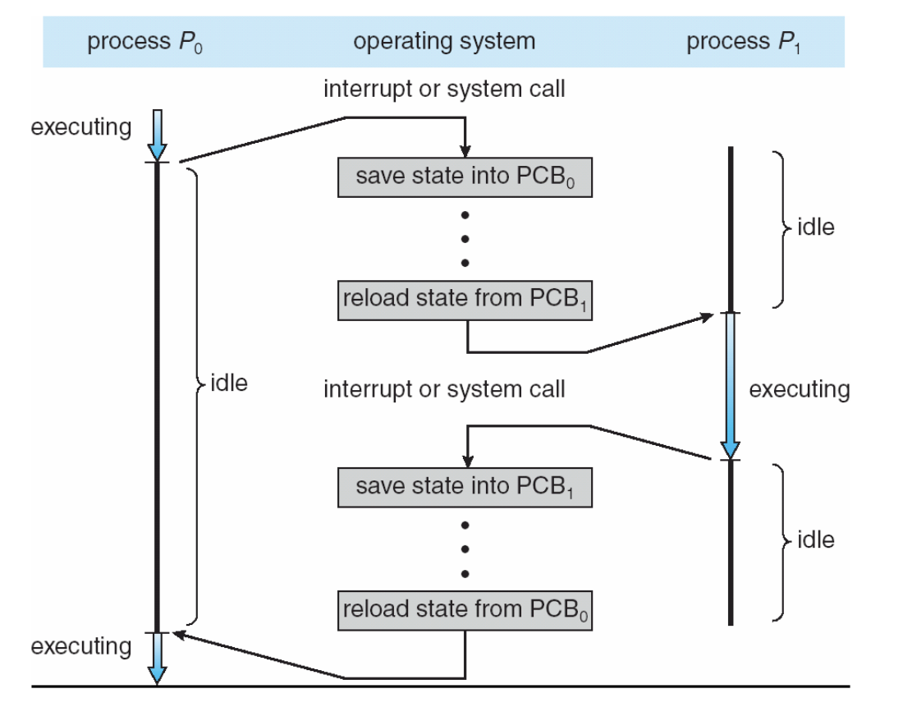
</p>

There are two processes. $P_0$ is executing, but a higher-priority $P_1$ arrives. $P_1$ cannot run immediately — the OS must first save $P_0$’s state into $PCB_0$ and then reload the state from $PCB_1$ so $P_1$ can execute.  

Later, when $P_0$ regains priority, the OS saves $P_1$’s state into $PCB_1$ and reloads $P_0$’s state from $PCB_0$.  

This switching allows both $P_0$ and $P_1$ to resume exactly where they left off.  

---

# Process Scheduling

The objective of **multiprocessing** is to keep the CPU busy at all times by ensuring some process is always running.  

The objective of **timesharing** is to switch the CPU frequently among processes so users can interact with programs in real time.  

The **process scheduler** selects a process from the pool of available ones and decides which executes on the CPU next.  
**Process scheduling** is the mechanism that determines the execution order of processes.  

## Scheduling Queues

The processor schedular maintes scheduling queues of processes:  

- **Job Queue**: Set of all processes in the system (always has everything) 
- **Ready Queue**: Set of all processes residing in main memory, ready and waiting for CPU.  
- **Device (I/O) Queues**: Set of processes waiting for an I/O device.  

Processes migrate among these queues depending on whether they need CPU, I/O, or are waiting to be admitted.  

<p align="center">
  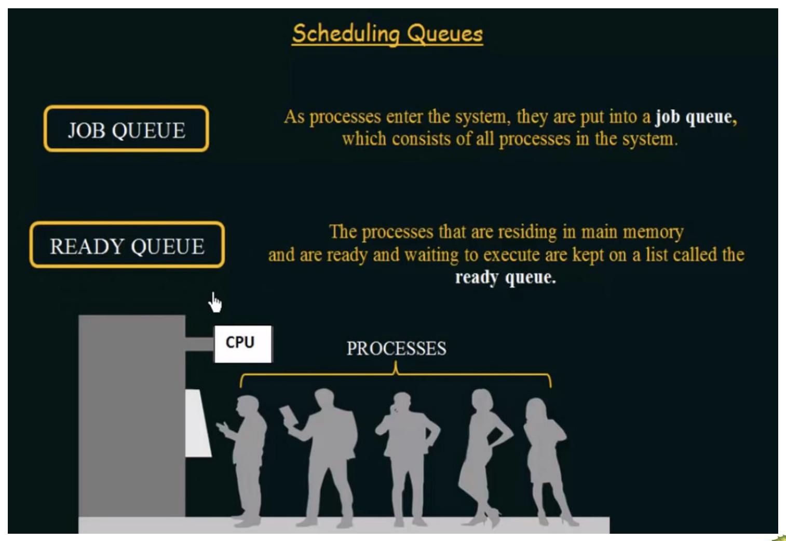
</p>

### Diagram of Scheduling

<p align="center">
  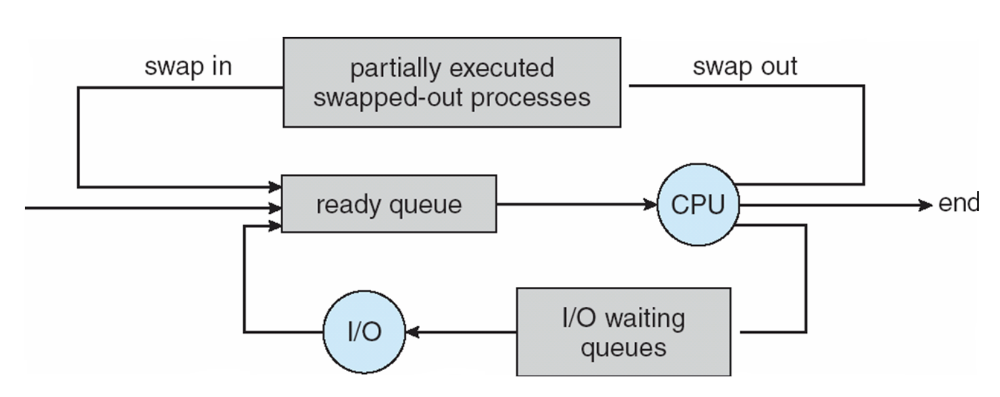
</p>

Suppose process $P_0$ is running on the CPU with all its required resources. Then, a higher-priority process $P_1$ arrives. Since $P_1$ must be given the CPU, $P_0$ is **swapped out** of memory before finishing. At this point, $P_0$ is considered **partially executed**. When resources free up, $P_0$ is **swapped back in**, placed into the ready queue, and can eventually continue execution on the CPU from where it left off.  


### More Complex Scheduling Diagram (Time Slice)

<p align="center">
  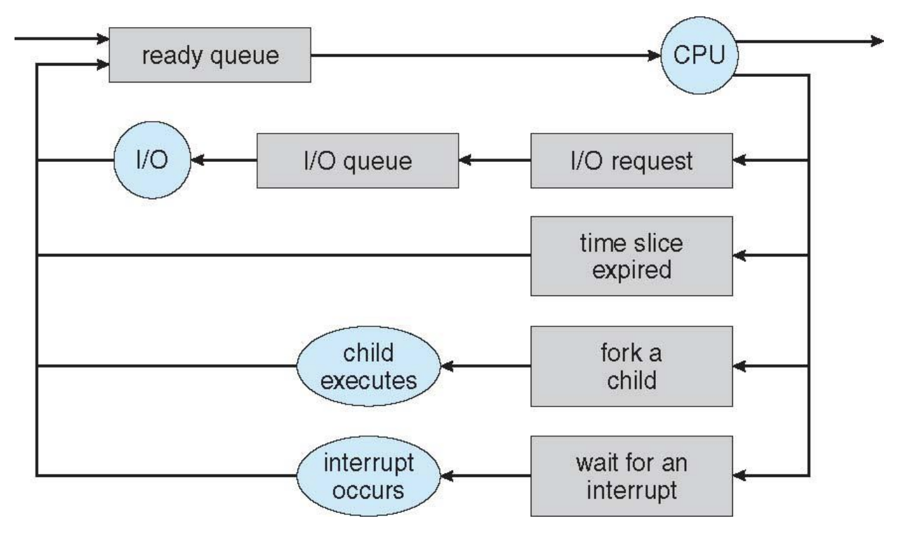
</p>

A process begins in the **ready queue** and is dispatched to the **CPU** for execution. While running, it may issue an **I/O request**, which moves it into the **I/O queue** until the operation completes, after which it returns to the ready queue. If a process exceeds its **time slice**, it is preempted and sent back to the ready queue so another process can run. The CPU can also **fork a child**, creating a new process that enters the system. Finally, an **interrupt** may occur, temporarily halting execution until the interrupt is serviced, after which the process is placed back into the ready queue.  


> **Why Multi-Thread Instead of Multiprocessing?**
>Multithreading allows multiple tasks to run concurrently within the same process. Multiprocessing does the same but across separate processors.  
>
>Multiprocessing has higher overhead and lower efficiency due to process creation, context switching, and communication costs.  
>
>Multithreading is lighter since threads share memory, switch faster, and communicate more efficiently — giving many of the same benefits as multiprocessing with less cost.  
>
> In terms of security, multithreading is riskier because one thread can interfere with another thread (in the same process).

---

# Process Creation

A **parent process** creates one or more **child processes**, forming a **tree of processes**. Each process is identified by a unique **process identifier (PID)**.  

### Resource Sharing
- Parent and children share all resources
- Children share a subset of parent's resources
- Parent and child share no resourecs

### Execution
- Parent and child may execute **concurrently**  
- Parent may also **wait** until children terminate  

### Example: A Tree of Processes in Linux
<p align="center">
  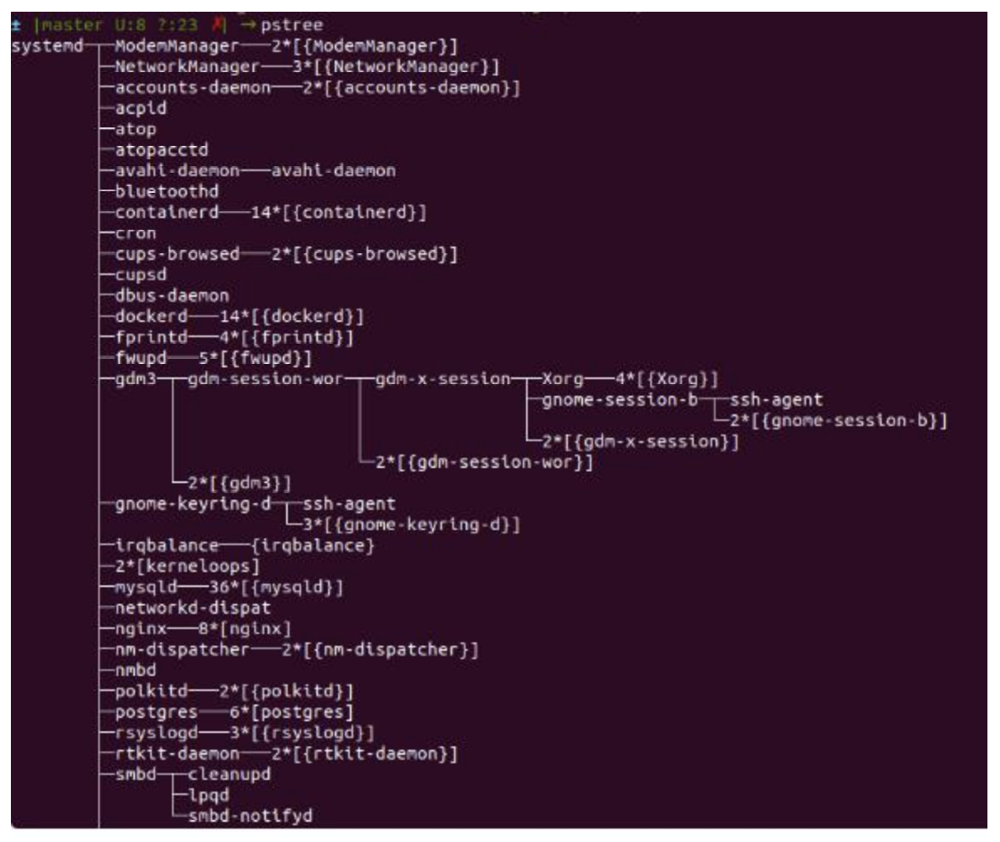
</p>

- `systemd` (**system daemon**) is the parent process of all the processes.

## Address Space
A child’s memory space can be:  
1. **Duplicate of the parent** (same code/data) 
2. **New program loaded** into its own space  

### UNIX Examples
<p align="center">
  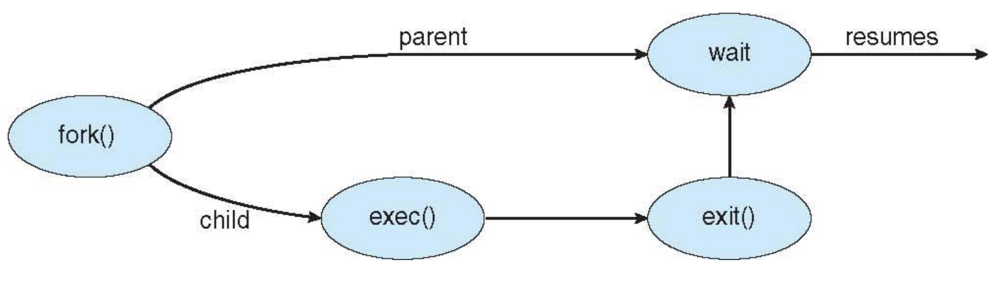
</p>

- `fork()` → system call creates a new (child) process that duplicates the current process; it returns $1$ for the parent, $0$ for the child, or $-1$ for an error

- `exec()` → system call used after a `fork()` to replace the process’s memory with a new program  

> `fork()` and `exec()` are UNIX system calls and do not exist directly in Windows. Instead, Windows provides the **`CreateProcess()`** API, which combines both steps into a single call.  

#### Example: C Program Forking Separate Process (Linux)
- `fork()` creates a child process.  
  - If the process is the **parent** after the `fork()`, it returns **1**.  
  - If the process is the **child** after the `fork()`, it returns **0**.  
  - If the call fails, it returns **-1**.  

```c
#include <sys/types.h>
#include <stdio.h>
#include <unistd.h>

int main() {
    pid_t pid = fork();

    if (pid < 0) { // Error
        fprintf(stderr, "Fork Failed"); 
        return 1;
    }
    else if (pid == 0) { // Child Process
        execlp("/bin/ls", "ls", NULL);
    }
    else { // Parent Process
        /* will wait for the child to complete */
        wait(NULL);
        printf("Child Complete\n");
    }
    return 0;
}
```

#### Example: Creating a Child Process via Windows API
```c
#include <stdio.h>
#include <windows.h>

int main(VOID)
{
    STARTUPINFO si;
    PROCESS_INFORMATION pi;

    /* allocate memory */
    ZeroMemory(&si, sizeof(si));
    si.cb = sizeof(si);
    ZeroMemory(&pi, sizeof(pi));

    /* create child process */
    if (!CreateProcess(NULL,               /* use command line */
        "C:\\WINDOWS\\system32\\mspaint.exe", /* command */
        NULL,                              /* don't inherit process handle */
        NULL,                              /* don't inherit thread handle */
        FALSE,                             /* disable handle inheritance */
        0,                                 /* no creation flags */
        NULL,                              /* use parent's environment block */
        NULL,                              /* use parent's existing directory */
        &si,
        &pi))
    {
        fprintf(stderr, "Create Process Failed");
        return -1;
    }

    /* parent will wait for the child to complete */
    WaitForSingleObject(pi.hProcess, INFINITE);
    printf("Child Complete");

    /* close handles */
    CloseHandle(pi.hProcess);
    CloseHandle(pi.hThread);
}
```

#### Example: Multiple `fork()` calls
```c
#include <stdio.h>
#include <sys/types.h>
#include <unistd.h>

int main()
{
    fork();
    fork();
    fork();
    printf("COSC 439 \n PID = %d\n", getpid());
    return 0;
}
```

```css
                               P
                 ┌─────────────┴─────────────┐
                 1                           0
           ┌─────┴─────┐               ┌─────┴─────┐
          11           10             01           00
        ┌─┴─┐        ┌─┴─┐          ┌─┴─┐        ┌─┴─┐
      111 110      101 100        011 010      001 000   ← 8 leaves (8 prints)

```
The output appears 8 times because `printf` is executed after the third `fork()`, so there are \(2^3 = 8\) concurrent processes at that point.

> In general, after $x$ sequential `fork()` calls, the number of processes AFTER the $x$-th fork is \(2^x\) (assuming all `fork()` calls are successful).


#### Example: Using exec() to run another program

**ex1.c**:
```cpp
#include <iostream>
#include <unistd.h>
#include <stdlib.h>
using namespace std;

int main(int argc, char *argv[])
{
    printf("PID of ex1.c = %d\n", getpid());
    char *args[] = {"COSC", "439", NULL};
    execv("./ex2", args); // This call replaces this process with the ex2 program if it succeeds. So the code below is actually never reached.
    printf("Back to ex1.c");
    return 0;
}
```

**ex2.c**
```c
#include <stdio.h>
#include <unistd.h>
#include <stdlib.h>

int main(int argc, char *argv[])
{
    printf("we are in ex2.c\n");
    printf("PID of ex2.c = %d\n", getpid());
    return 0;
}
```

#### Example: Logical AND with `fork()`
```c
#include <stdio.h>
#include <sys/types.h>
#include <unistd.h>

int main(void) {
    if (fork() && fork()) {
        fork();
    }
    printf("Hello\n");
    return 0;
}
```

**Result:** Prints "Hello" 4 times.

#### Example: Logical OR with `fork()`
```c
#include <stdio.h>
#include <sys/types.h>
#include <unistd.h>

int main(void) {
    if (fork() || fork()) {
        fork();
    }
    printf("Hello\n");
    return 0;
}
```

**Result:** Prints "Hello" 5 times.

#### Example: Logical AND + OR with `fork()`
```c
#include <stdio.h>
#include <sys/types.h>
#include <unistd.h>

int main(void) {
    if (fork() && fork()) {         
        if (fork() || fork()) {     
            fork();                 
        }
    }
    printf("Hello\n");
    return 0;
}
```

**Result:** Prints "Hello" 7 times.

---

# Process Termination
A process executes its last statement and asks the OS to delete it with **`exit()`**.  
- The **exit status** is made available to the parent (collected via **`wait()`**)  
- The OS **deallocates** the process’s resources (memory, open files, etc.)

A **parent** may terminate a child using **`abort()`** when:  
- The child **exceeds allocated resources** 
- The child’s **task is no longer needed**  
- The **parent is exiting** and the OS does not allow the child to continue 

**Cascading Termination:** When a parent dies, **all descendants** (children, grandchildren, etc), terminnation is initiated by the OS. 

---

# Interprocess Communication (IPC)
Processes can be **independent** or **cooperating**.  
- **Independent Process** **cannot** affect or be affected by other processes in the system.  
- **Cooperating Process** **can** affect or be affected by other processes.  
  - Any process that **shares data** with others is a cooperating process.

**Example:** Cooperating processes are those whose execution can affect each other because they share resources or data. Suppose process $P1$ is writing the number `100` to a file while process $P2$ needs to read from that same file. If only one process is allowed access at a time, $P2$ must wait until $P1$ releases the file; this enforced condition ensures correct synchronization. Without such a condition, both processes may access the file concurrently: $P1$ writes `100` while $P2$ checks the file to see if `100` exists. Even though they run in parallel and potentially interfere with each other’s operations, they are still considered **cooperating processes** because the behavior of one directly influences the other.

## Why Cooperate?
- **Information sharing:** Shared files/resources need concurrent access  
- **Computation speedup:** Tasks can be brokwn down to subtasks and run under multiple processes  
- **Modularity:** Divide system functions into separate processes/threads for organization and manageability  
- **Convenience:** Enables multitasking 

## Interprocess Communication (IPC) Models
Two ways cooperating processes **exchange data and information**:  
- **Shared Memory:** A region of memory that is **shared** by the cooperating processes; they **read/write** data in that region.  
- **Message Passing:** Processes **communicate by exchanging messages**.

### Communications Models Diagrams
<p align="center">
  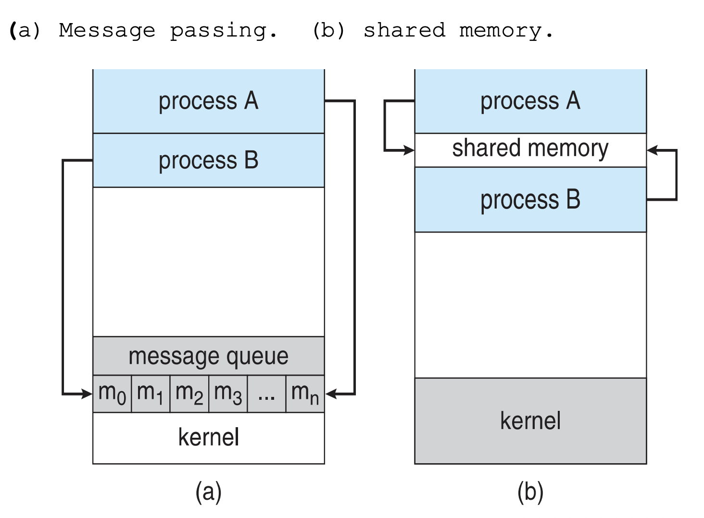
</p>

- **(a) Message passing:** processes place messages into a **kernel-managed message queue**; the OS mediates the transfer  
- **(b) Shared memory:** the OS maps a **shared region** visible to both processes; each **reads/writes** the region directly

## Shared Memory

<p align="center">
  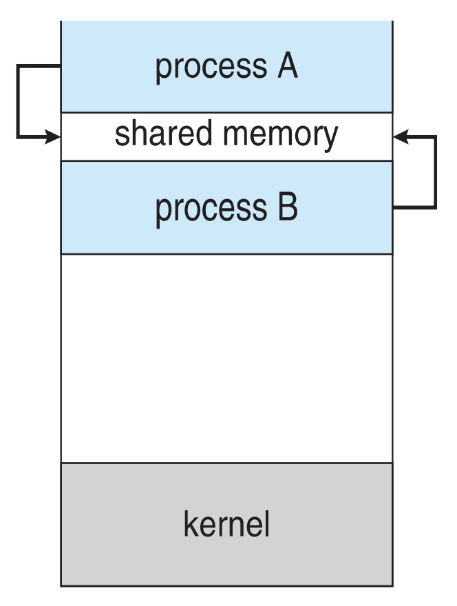
</p>

To enable interprocess communication, processes can establish a **shared memory region**.  
- This region usually exists within the address space of the process that created it  
- Other processes must **attach** the shared segment to their own address space before using it  

However, by default, the OS **prevents one process from directly accessing another’s memory**.  
- Shared memory requires **mutual agreement** between two or more processes to remove this restriction

> The OS provides only the means to set up the shared memory. The responsibility of managing reads/writes falls entirely on the cooperating processes.  

### Major Issue: Synchronization
- Multiple processes may try to read and write at the same time, leading to **race conditions**.  
- A proper synchronization mechanism via some algorithm (e.g. semaphores, locks, monitors) must be in place to coordinate access.  
- Synchronization ensures that processes do not interfere with each other when accessing shared memory.  

## Message Passing

<p align="center">
  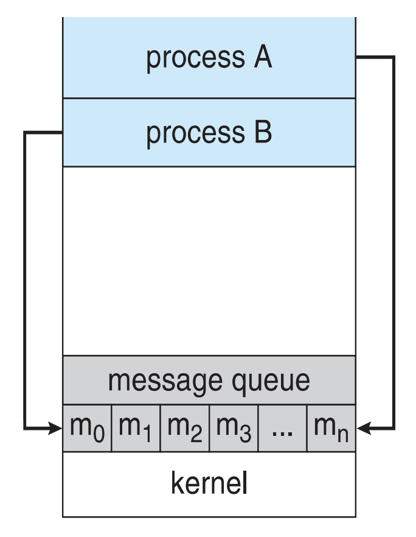
</p>

**Message Passing** is a mechanism that allows processes to **communicate** and **synchronize** their actions **without sharing the same address space**.  
- Useful in **distributed environments** where processes run on different computers connected by a **network**  
- Example: Chat applications using a **client–server model**  

Message passing is supported by two fundamental operations:  
- `send(message)`  
- `receive(message)`  

*Note:* The size of a message can be **fixed** or **variable** depending on the system.

### Establishing Communication
For processes \(P\) and \(Q\) to exchange information, they must:  
1. **Establish a communication link** between them.  
2. **Exchange messages** via `send` and `receive`  

The communication link can be implemented in different ways:  
- **Direct or Indirect** communication  
- **Synchronous or Asynchronous** communication  
- **Automatic or Explicit Buffering**  

### Direct Communication
In **direct communication**, processes must explicitly **name each other**:  
- `send(P, message)` → send message to process \(P\)  
- `receive(Q, message)` → receive message from process \(Q\)  

**Issue:** If process identifiers change (like a process terminates and restarts with a new PID), **all references must be updated**. This makes direct communication less flexible and harder to maintain (and leads to indirect communication).  

### Indirect Communication
In **indirect communication**, processes do not name each other directly. Instead, they communicate via **mailboxes (ports)**:  
- Each mailbox has a **unique ID**  
- Processes can send/receive messages only if they **share a mailbox**  

**Operations:**
- Create a new mailbox (port)  
- Send and receive messages through the mailbox  
- Destroy a mailbox  

**Primitives:**
- `send(A, message)` → send a message to mailbox \(A\)  
- `receive(A, message)` → receive a message from mailbox \(A\)  

### Synchronization
Message passing may be either **blocking (synchronous)** or **non-blocking (asynchronous)**:  

- **Blocking Send:** Sender waits until the message is received 
- **Blocking Receive:** Receiver waits until a message arrives  

- **Non-blocking Send:** Sender continues execution without waiting  
- **Non-blocking Receive:** Receiver either gets:  
  - A valid message, or  
  - A null/empty message if nothing is available

Blocking operations create a **synchronous system** (tight coordination), while non-blocking enables **asynchronous communication** (looser coupling).  

### Buffering
Messages exchanged between processes are stored in **temporary queues** associated with the communication link. This is known as **buffering**.  

Buffering can be implemented in three ways:  
1. **Zero Capacity**:  
   - No queue; sender must wait until receiver is ready  
   - Pure synchronization, no storage  
2. **Bounded Capacity**:  
   - Queue has finite length \(n\)  
   - Sender must wait if the queue is full  
3. **Unbounded Capacity**:  
   - Queue has (theoretically) infinite length  
   - Sender never waits  

---

# Communications in Client–Server Systems

## Sockets
A **socket** is an **endpoint for communication** between two processes.  
- You can think of it as a door through which information flows between two process, whether they are on the same computer or across the world (over a network)
- A pair of processes communicating over a network employ a pair of sockets — one for each process

A socket is identified by an:  
- **IP Address** of the host machine  (`localhost` refers to the same computer)
- **Port Number** identifies the specific application/process on the remote computer with which communication is taking place 

**Analogy:** The IP address takes you to the correct building, while the port number guides you to the specific apartment inside that building.

**How it works:**
<p align="center">
  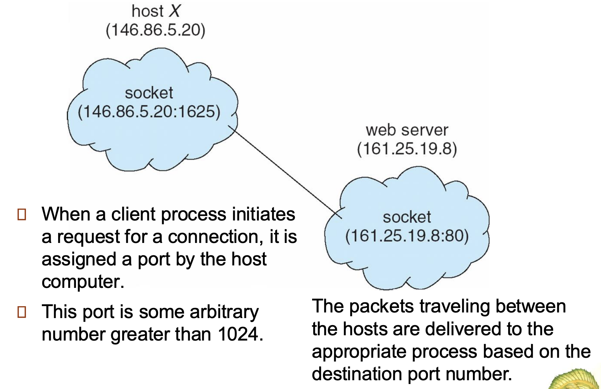
</p>

1. The **server process** binds to a specific port and **listens** for client requests.  
2. A **client process** initiates a connection request to the server’s IP:port.  
3. The server accepts the request, and the socket pair establishes a bidirectional communication channel.  

**Example:**  
- Web servers listen on port **80** (HTTP) or **443** (HTTPS)  
- FTP servers use port **21**, Telnet uses port **23**  

> Note, ports **below 1024** are *well-known ports* for standard services. 

**Example Code:** https://www.geeksforgeeks.org/cpp/socket-programming-in-cpp/

### Key Socket Functions
- `socket(domain, type, proto)` → Create an endpoint (e.g., IPv4/TCP) like buying a phone
- `bind(fd, addr, len)` → Attach local IP:port to the socket like getting a number.
- `listen(fd, backlog)` → Server waits for incoming calls like turning ringer on.
- `accept(fd, addr*, len*)` → Returns a *new* connected socket per client like picking up the phone
- `connect(fd, addr, len)` → Client initiates a connection to server’s IP:port like dialing the phone..
- `send/recv(fd, buf, n, flags)` → Exchanging data like talking and listening on the phone.
- `read/write(fd, buf, n)` → Alternative data exchange (treating a socket like a file).
- `close(fd)` → Frees the descriptor; TCP does a graceful FIN/ACK. This is like hanging up the phone. 

## Pipes
A **pipe** acts as a conduit that allows two processes to communicate. They are like files, but unlike files, which are stored permanently on disk, pipes exist **in memory (RAM)** and vanish when processes finish.  

**Why use pipes?**
- If two processes are on the same machine (e.g. `localhost` or `0000`), sockets can be used but are **overkill**  
- Pipes are **faster** because communication stays inside the OS memory  

**Example (Windows CLI):**
If you run `dir` in Windows:  
- The **CLI (parent)** forks a child process to execute `dir`  
- The child process writes results to the (ordinary) pipe  
- The parent process reads the results back through the pipe and output is displayed to the user  

### Ordinary Pipes
Ordinary Pipes allow communication in standard producer-consumer style.

<p align="center">
  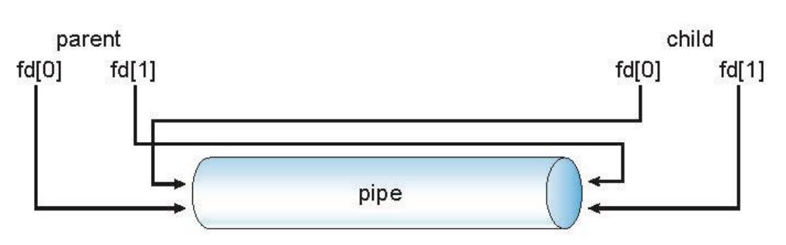
</p>

- Producer writes to one end (the **write-end** of the pipe)
- Consumer reads from the other end (the **read-end** of the pipe)
- Unidirectional (one-way communication)  
- Requires parent-child relationship between communicating processes 

*Note:* In Windows, these are called **anonymous pipes**.  

**Example**: https://cdynamicprogramming.blogspot.com/p/pipes-in-operating-system.html

### Named Pipes
- More flexible and powerful than ordinary pipes  
- Support **bidirectional communication**  
- Do **not** require a parent–child relationship  
- **Multiple processes** can use the named pipe for communication  
- Provided on both **UNIX** and **Windows** systems  

*Note:* In Windows, named pipes are created with the `CreateNamedPipe()` API.  

## Remote Procedure Calls (RPCs)
A **Remote Procedure Call (RPC)** is a protocol that one program can use to request a service from another program located in another computer network without having to understand the network's details. It abstracts procedure calls between processes on networked systems (using ports for service differentiation).

### Characteristics
- RPC is conceptually similar to IPC but works across separate systems.  
- Communication uses a **message-based communication scheme** rather than direct memory access  
- Messages in RPC are **structured** and thus are no longer just packets of raw data. They include:  
  - Identifier of the function to execute  
  - Parameters for that function  
  - Return values  

### Stubs and Marshalling
- **Stub**: A client-side proxy for the actual procedure on the server  
  - Hides the network details  
  - Allows the client to invoke a function as if it were local  
- **Marshalling**: Packaging procedure parameters into a message format suitable for network transmission  
- **Unmarshalling**: Server-side unpacking of these parameters  

**Process Flow:**  
1. The client calls the local stub with the procedure name + parameters  
2. The stub locates the server, marshalls the parameters, and sends a request  
3. The server-side stub receives the request, unmarshalls the parameters, and executes the procedure  
4. Results are marshalled back and returned to the client through the same mechanism  

> On Windows, stubs are generated from specifications written in **Microsoft Interface Definition Language (MIDL)**.  

### Example: RPC Execution Model

<p align="center">
  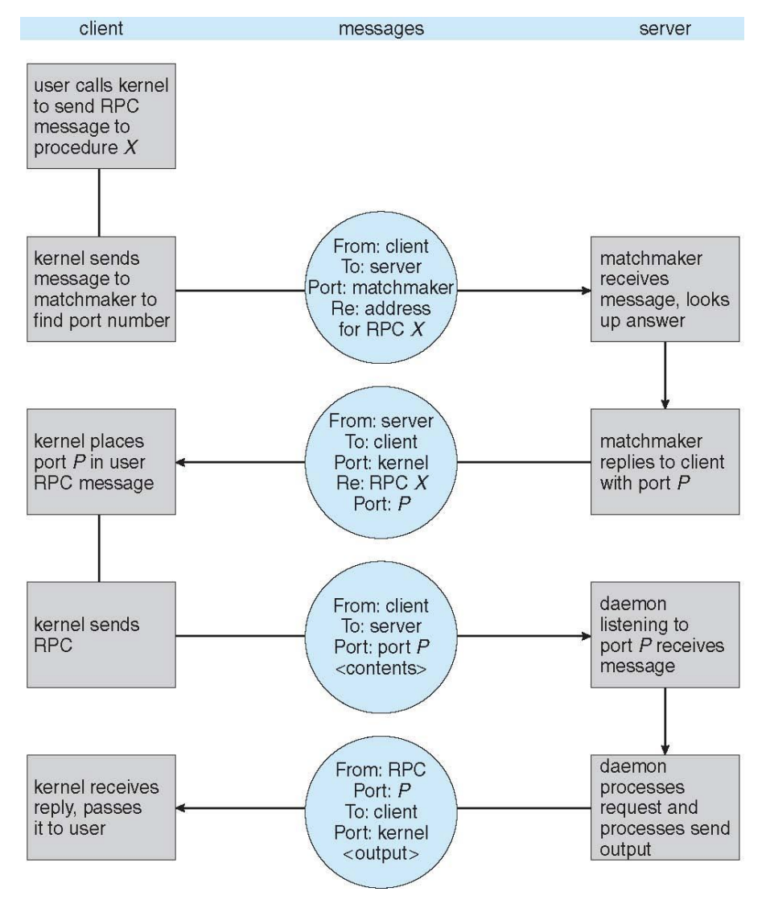
</p>

1. **Client** invokes a procedure \(X\)  
2. **Kernel** sends a message to a **matchmaker/daemon** to find the port for that RPC  
3. Matchmaker replies with the correct port  
4. Client sends the RPC request to the server at that port  
5. Server daemon receives the request, unmarshalls parameters, and executes the procedure  
6. Output is marshalled and returned to the client  

### Pros and Cons
**Pros:**
- Transparency: Hides networking details (ports, marshalling)  
- Simplicity: Procedure call looks identical to a local function call  
- Portability: Works across heterogeneous systems (Windows, UNIX, etc)  

**Cons**:
- Latency: Remote calls are much slower than local calls  
- Partial failures: The client may fail even if the server is running (and vice versa)  
- Stub generation: Each remote function requires its own stub, which increases complexity  

