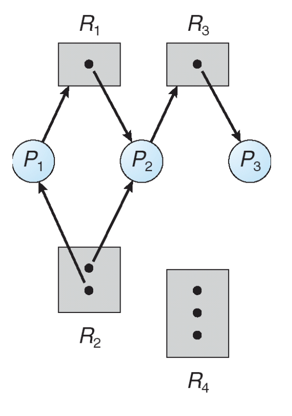

# Process Synchronization

## Background
- **Independent Process**: Processes that execute without depending on others  
- **Cooperating Process**: Processes that depends on or interacts with other processes or shares resources (memory, files, messages)  
- Cooperation enables parallelism but introduces synchronization challenges.

## Why Synchronization is Needed
- **Parallel execution**: Processes/threads can be interrupted at any time  
- **Shared data**: Concurrent access can lead to **data inconsistency**  

Maintaing data consistency requires mechanisms to ensure the *orderly execution* of cooperating processes.

### Example
Imagine you are working on a group project with one other student. Think of the two students as cooperating processes. Each student is responsible for 50% of the assignment, but if one fails to do their part, the final grade is affecte. 

Now suppose you spend four hours writing the introduction. When you open the shared Google Doc, you discover that your partner has already written their own introduction. Because you both worked on the same section without coordination, your effort was wasted. This illustrates the problem of concurrent access: processes must be aware of each other’s actions.

If you then paste your version of the introduction and overwrite what your partner wrote, the result is data inconsistency. One process (you) has changed the shared resource without the other process (your partner) being aware of it.

---

# Problems with Process Synchronization

## Race Condition
A **race condition** is a type of errors that occurs in concurrent computing when multiple processes or threads access or manipulate shared data simultaneously, and the final outcome depends on the order or timing of their execution.

### Example
`counter++` could be implemented as:
```
register1 = counter
register1 = register1 + 1
counter = register1
``` 

`counter--` could be implemented as:
```
register2 = counter
register2 = register2 - 1
counter = register2
``` 

If interleaved:
```
S0: P1 execute register1 = counter         {register1 = 5}
S1: P1 execute register1 = register1 + 1   {register1 = 6}
S2: P2 execute register2 = counter         {register2 = 5}
S3: P2 execute register2 = register2 - 1   {register2 = 4}
S4: P1 execute counter = register1         {counter = 6}
S5: P2 execute counter = register2         {counter = 4}
```

Final result = **4**  

> "Whoever loses the race" determines the final value.

## Producer–Consumer Problem (Bounded Buffer Problem)  
- **Producer**: Generates data and puts it into a buffer (a shared memory or data structure e.g. queue)  
- **Consumer**: Removes data from buffer for processing  
- **Buffer types**:
  - *Unbounded*: No practical limit on size
  - *Bounded*: Fixed size → requires synchronization

*Key Challenge*: The producer and consumer operate concurrently but because they share a buffer, synchronization mechanisms are needed to prevent issues like:

- **Overwriting** data (when the producer tries to add data to a full buffer)
- **Underflowing** (when the consumer tries to remove data from an empty buffer)

The challenge is to ensure that the producer does not produce data when the buffer is full and the consumer does not consume data when the buffer is empty.

*Solution*: The producer and consumer processes must be synchronized.

### Example

**Producer Code:**
```c
while (true) {
    /* produce an item in next_produced */

    while (counter == BUFFER_SIZE); /* do nothing */

    buffer[in] = next_produced;
    in = (in + 1) % BUFFER_SIZE;
    counter++;
}

/* Counter is incremented when a new item is added.
   Initially, counter variable = 0 */
```

**Producer Trace:**
```
| Step | Action                         | Buffer       | in | counter |
|------|--------------------------------|--------------|----|---------|
| 0    | Initial                        | [_, _, _]    | 0  | 0       |
| 1    | Produce A → insert at [0]      | [A, _, _]    | 1  | 1       |
| 2    | Produce B → insert at [1]      | [A, B, _]    | 2  | 2       |
| 3    | Produce C → insert at [2]      | [A, B, C]    | 0  | 3 (FULL)|
```

**Consumer Code:**
```c
while (true) {
    while (counter == 0); /* do nothing */

    next_consumed = buffer[out];
    out = (out + 1) % BUFFER_SIZE;
    counter--;

    /* consume the item in next_consumed */
}

/* Counter is decremented when a new item is removed.
   Initially, counter variable = 0 */

```

**Consumer Trace:**
```
| Step | Action                         | Buffer       | out | counter |
|------|--------------------------------|--------------|-----|---------|
| 0    | Initial                        | [A, B, C]   | 0   | 3        |
| 1    | Consume A ← remove from [0]    | [_, B, C]   | 1   | 2        |
| 2    | Consume B ← remove from [1]    | [_, _, C]   | 2   | 1        |
| 3    | Consume C ← remove from [2]    | [_, _, _]   | 0   | 0 (EMPTY)|
```

## Critical Section Problem
Consider a system of $n$ processes ${p_0, p_1, ... p_{n-1}}$. Each process $p_i$ has a segment of code, called a **critical section** in which $p_i$ is accessing or manipulating shared data.  

**Requirement**: When one process is executing in its critical section, no other process is allowed to execute their critical sections simultaneously.

### General Structure of Process $P$
The critical section problem is to design a **protocol** that ensures processes can safely share resources.

```
do {
entry section // Request to enter
critical section // Shared resource access
exit section // Release access
remainder section // Non-critical work
} while (true);
```
- Each process must ask permission to enter its critical section
- The section of code making this request is called the entry section
- The critical section may be followed by an exit section
- The remaining code is called the remainder section


### Solution to Critical Section Problem

**Mutual Exclusion:** If process $P_i$ is executing in its critical seciton, then no other processes can be executing in their critical sections.

**Progress:** If no process is executing in its critical section and there exist some processes that wish to enter their critical section, then the selection of the processes that will enter the
critical section next cannot be postponed indefinitely.

**Bounded Waiting:** A bound must exist on the number of times that other processes are allowed to enter their critical sections after a process has made a request to enter its critical section and before that request is granted.
- Assume that each process executes at a nonzero speed
- No assumption concerning relative speed of the $n$
processes

Additionally, the OS handles the critical section problem differently depending on whether the kernel is preemptive or non-preemptive:
- **Preemptive:** Allows preemption of process when running in kernel mode.
- **Non-preemptive:** Runs until exits kernel mode, blocks, or voluntarily yields CPU. Essentially free of race conditions in kernel mode.

### Peterson’s Solution
A classic software-based solution to synchronization problem for the critical section (in the two-process case). It satisfies all three requirements: mutual exclusion, progress, and bounded waiting.  

#### Shared Variables
- **int turn** → Indicates whose turn it is between the two processes to enter the critical section  
- **boolean flag[2]** → Marks if a process is ready to enter  
  - `flag[i] = true` → Process $P_i$ wants to enter  

#### Algorithm (for Process $P_i$)

```c
do {
    flag[i] = true;     // P_i is ready
    turn = j;           // Give priority to P_j
    while (flag[j] && turn == j);  // Busy wait if P_j also wants CS

    // ---- Critical Section ----

    flag[i] = false;    // P_i leaves CS
    // ---- Remainder Section ----
} while (true);

```

#### Example Walkthrough

Suppose we have two processes $P_0$ and $P_1$. Both want to enter their critical section at the same time.

**Both want to enter CS:**
- $P_0$: sets `flag[0] = true`, then `turn = 1`
- $P_1$: sets `flag[1] = true`, then `turn = 0`

**Who enters first?**
- If both set flags, the **last write to `turn` decides**
  - Suppose `turn = 1` → $P_0$ waits (because it gave priority to $P_1$)
  - $P_1$ enters the CS

**After $P_1$ exits:**
- $P_1$ sets `flag[1] = false`
- $P_0$ sees `flag[1] = false` → enters CS immediately


#### Why Peterson’s Works

1. **Mutual Exclusion**
   - $P_i$ enters CS only if `flag[j] = false` **OR** `turn = i` ⇒ Both cannot be in CS at the same time

2. **Progress**
   - If neither is in CS, whichever process sets its flag and gets the turn proceeds  
   - No indefinite postponement  

3. **Bounded Waiting**
   - Once $P_i$ finishes, $P_j$ is guaranteed to enter next if waiting  

### Test and Set

A hardware solution to the synchronization problem by using an **atomic instruction**.

#### Key Idea
- There is a **shared lock variable** which can be either two values:
  - `0` → unlocked
  - `1` → locked
- Before entering the **critical section**, a process checks the lock:
  - If locked → it waits (busy waiting / spinlock)
  - If free → it acquires the lock and enters the critical section

#### `test_and_set` Instruction

```c
boolean test_and_set (boolean *target) {
    boolean rv = *target;
    *target = TRUE;
    return rv;
}
```

**Properties:**
1. Executed atomically (uninterruptible). An **atomic operation** is indivisible:  
    - It cannot be interrupted during execution  
    - Ensures that only one process at a time can modify the lock variable 
2. Returns the original value of target
3. Sets the new value of target to TRUE

#### Algorithm using `test_and_set()`
```c
do {
     /*
     * test_and_set(&lock) is an atomic operation:
     * 1. Reads the current value of lock (rv)
     * 2. Sets lock = true (marks it as taken)
     * 3. Returns the rv value
     *
     * - If rv == false → we acquired the lock (enter critical section)
     * - If rv == true  → someone else has the lock, keep spinning
     */
   while (test_and_set(&lock)); // busy wait if lock = TRUE

   // critical section

   lock = FALSE; // release lock

   // remainder section
} while (TRUE);

```

**Correctness:**
- Mutual Exclusion: Preserved (only one process gets lock = FALSE)
- Bounded Waiting: ❌ Not guaranteed. A process may be repeatedly bypassed by others while waiting thus starvation is possible

#### Bounded-Waiting Mutual Exclusion with `test_and_set()`
Enhanced version ensures fairness by maintaing a waiting array and passing the lock in round-robin.

```c
do {
    waiting[i] = true;
    key = true;
    while (waiting[i] && key)
        key = test_and_set(&lock);

    waiting[i] = false;

    /* critical section */

    j = (i + 1) % n;
    while ((j != i) && !waiting[j])
        j = (j + 1) % n;

    if (j == i)
        lock = false;
    else
        waiting[j] = false;

    /* remainder section */
} while (true);

```

### Mutex Locks

Previous synchronization solutions are often low-level and impractical for programmers. OS designers introduced higher-level constructs like mutex locks to solve the critical section problem more cleanly. THe simplest being a **Mutex (Mutual Exclusion) Lock**.

- **How it works**:  
  1. A process must first **acquire()** the lock before entering its critical section  
  2. When done, it must **release()** the lock  

- **Implementation**: 
  - A **boolean variable** indicates if the lock is available  
    - `true` → lock available  
    - `false` → lock taken    
  - `acquire()` and `release()` must be **atomic operations** (hardware-enforced)  
  
- **Limitation**: Usually requires **busy waiting** (a process keeps checking in a loop until lock is free). Therefore, this type of lock is called a **spinlock**.  

#### Algorithm for Mutex Locks

**Pseudocode for Mutex Locks:**
```c
boolean available = true; // Initially lock is free

void acquire() {
    while (!available); // Busy wait (infinite loop) until lock becomes available
    available = false; // Lock acquired
}

void release() {
    available = true; // Lock released
}
```

**Process Structure with Mutex:**
```c
do {
    acquire(); // Enter CS only if lock is free
    
    // ---- Critical Section ----
    
    release(); // Unlock after CS

    // ---- Remainder Section ----
} while (true);
```

Guarantees mutual exclusion, but if lock is heavily contended, CPU cycles are wasted in busy waiting.

### Semaphore

Semaphores were introduced by Dijkstra as a synchronization mechanism to manage concurrent processes using a **simple integer value**.

#### Key Ideas
- A semaphore is a **shared non-negative integer variable** used to control access to a critical section.
- Denoted as Semaphore $S$ (integer variable)
- Can only be accessed via **two atomic operations**:
  - `wait(S)`  → also known as `P()` (from Dutch *proberen*, "to test")
  - `signal(S)` → also known as `V()` (from Dutch *verhogen*, "to increment")

#### Semaphore Operations

**`wait(S)`:**
```c
wait(S) {
    while (S <= 0) ;   // busy wait
    S--;
}
```

**`signal(S)`:**
```c
signal(S) {
    S++;
}
```

Again, only one process can modify the semaphore value at a time preventing race conditions.


#### Types of Semaphores
1. **Binary Semaphore (Mutex Lock)**
    - Value can only be $0$ or $1$
    - Behaves like a mutex lock
    - Example:
      - $S = 1$, available
      - If $P_1$ executes `wait(S)`, $S$ becomes $0$ so no other process can enter
      - After $P_1$ executes `signal(S)`, $S = 1$ and now another process may enter

```c
semaphore S = 1;  // binary semaphore

Process Pi:
do {
    wait(S); // acquire lock
    
    // ---- Critical Section ----
    
    signal(S); // release lock
    
    // ---- Remainder Section ----
} while (true);
```

2. **Counting Semaphore**
- Value can range over an unrestricted domain (useful for resource pools like multiple identical printers)
- Example:
  - $S = 2$ (two resources available)
  - $P_1$ executes `wait(S)` → $S = 1$
  - $P_2$ executes `wait(S)` → $S = 0$
  - $P_3$ must wait until one process calls `signal(S)`


#### Drawbacks
Same issue with Mutex, busy waiting wastes CPU cycles because while one process is in CS, others loop continuously at the entry section. 

#### Semaphore Implementation with no Busy Waiting
Instead of busy waiting:
1. Process blocks itself and moves into a waiting queue
2. When resource becomes available, process is woken up

We make use of a struct:
```c
typedef struct {
    int value; // semaphore value (int)
    struct process *list; // queue of waiting processes
} semaphore;
```

that consists of two operations:
- `block()` → place process into waiting queue
- `wakeup(P)` → remove process $P$ from queue and move it to ready state

**No-Busy-Wait Implementation:**
```c
wait(semaphore *S) {
    S->value--;
    if (S->value < 0) {
        add this process to S->list;
        block();
    }
}

signal(semaphore *S) {
    S->value++;
    if (S->value <= 0) {
        remove a process P from S->list;
        wakeup(P);
    }
}
```

#### Problems with Semaphores

Semaphores are powerful synchronization primitives, but incorrect usage can easily introduce bugs such as deadlock, starvation, or incorrect mutual exclusion.

**Common Incorrect Usages:**

1. **Reversing the order of operations**
   ```c
   signal(mutex);   // unlock first (incorrect)
   ...
   wait(mutex);     // lock later (wrong order)
   ```
    - Violates the critical section protocol
    - Multiple processes may enter at the same time → race conditions

2. **Double wait on the same semaphore**
    ```c
    wait(mutex);
    ...
    wait(mutex);   // second wait causes indefinite block
    ```
    - Process locks itself out
    - No matching `signal(mutex)` means a self-deadlock

3. **Omitting semaphore operations**
    - Forgetting a `wait(mutex)` means mutual exclusion is not enforced
    - Forgetting a `signal(mutex)` means resource stays locked, blocking others indefinitely
    - Omitting both means critical section is essentially unprotected

### Deadlock and Starvation

#### Deadlock
A **deadlock** occurs when **two or more processes are waiting indefinitely** for an event that can only be triggered by one of the waiting processes.  
- In this situation, none of the processes can proceed, creating a circular wait.

**Example (Two Processes with Semaphores):**

Let $S$ and $Q$ be two semaphores initialized to `1`:

Process $P_0$:
```c
wait(S);
wait(Q);
// Critical Section
signal(S);
signal(Q);
```

Process $P_1$:
```c
wait(Q);
wait(S);
// Critical Section
signal(Q);
signal(S);
```
Suppose `P0` executes `wait(S)` (locks `S`) and `P1` executes `wait(Q)` (locks `Q`).  

Now:
  - `P0` waits on `Q` but it is already locked by `P1`  
  - `P1` waits on `S` but it is already locked by `P0.  

So, neither process can proceed and causes a deadlock.

#### Starvation
**Starvation** (also called **indefinite blocking**) is not the same as deadlock. It occurs when a process **never gets scheduled access to resources** because higher-priority processes keep preempting it. The process is ready to execute but is indefinitely postponed.  

**Example:**
Suppose there are 10 processes:

```nginx
P1 → P2 → ... → P10
```

If scheduling always picks the highest priority and a new process P11 arrives with higher priority than P10, then P10 will be postponed until the completion of P11. This can continue occuring if processes with higher priority than P10 arrive causing P10 to starve.

---

# Classical Problems of Synchronization

## Bounded-Buffer Problem

The **Bounded-Buffer Problem** describes synchronization between a **Producer** and **Consumer** sharing a finite buffer of `n` slots.

- Each slot can store **one unit of data**  
- The Producer inserts data into empty slots
- The Consumer removes data from filled slots  

<p align="center">
  
</p>

**Key Constraints:**
- Producer must not insert data when the buffer is full  
- Consumer must not remove data when the buffer is empty  
- Producer and Consumer should not access the buffer simultaneously  

### Solution Using Semaphores

We use **three semaphores**:

1. `mutex` → Binary semaphore for mutual exclusion (initialized to 1)  
2. `empty` → Counting semaphore tracking empty slots (initialized to `n`) 
3. `full` → Counting semaphore tracking filled slots (initialized to 0) 

**Producer Process:**
```c
do {
    wait(empty); // Wait until there is an empty slot
    wait(mutex); // Acquire lock

    // ---- Critical Section ----

    add_data_to_buffer();

    signal(mutex); // Release lock
    signal(full); // Increment count of filled slots
} while (true);
```

**Consumer Process:**
```c
do {
    wait(full); // Wait until there is data
    wait(mutex); // Acquire lock

    // ---- Critical Section ----
    
    remove_data_from_buffer();

    signal(mutex); // Release lock
    signal(empty); // Increment count of empty slots
} while (true);
```

## Readers-Writers Problem

The **Readers-Writers Problem** arises when a shared data set is accessed by multiple concurrent processes:  

- **Readers** → Only read the data set; they do not perform updates.  
- **Writers** → Can both read and modify the data set.  

**Key Requirements:**
- Multiple readers can read the data **simultaneously** as it causes no issues  
- If a writer is active, no reader or writer should access the data, otherwise, inconsistency occurs.  

### Solution Using Semaphores

We introduce synchronization with:  

1. `read_count` → Integer variable (initialized to 0) to tracks how many readers are currently accessing the data  

2. `mutex` → Binary semaphore (initialized to 1) to ensure mutual exclusion when updating `read_count`  

3. `wrt` → Binary semaphore (initialized to 1) to ensure exclusive access to the shared resource for writers  


**Writer Process:**
```c
do {
    wait(wrt); // Request exclusive access to the resource

    // ---- Critical Section ----

    perform_write(); // Writer modifies the shared data

    signal(wrt); // Release resource
} while (true);
```

**Reader Process:**
```c
do {
    wait(mutex); // Lock before updating read_count
    read_count++;
    if (read_count == 1)
        wait(wrt); // First reader locks writers
    signal(mutex);

    // ---- Critical Section ----

    perform_read();  // Reader reads the shared data

    wait(mutex);
    read_count--;
    if (read_count == 0)
        signal(wrt); // Last reader unlocks writers
    signal(mutex);
} while (true);
```

Multiple readers can read concurrently (as long as no writer is active). Writers get exclusive access — no readers or other writers interfere. This method ensures:
- Mutual Exclusion ✅
- Progress ✅
- Bounded Waiting ✅

## Dining-Philosophers Problem

The **Dining Philosophers Problem** is a classic synchronization problem illustrating challenges of **deadlock, starvation, and concurrency control**.

### Problem Setup
Philosophers spend their lives alternating between thinking and eating. To eat, each philosopher needs two chopsticks (one on the left and one on the right). After eating, they release both chopsticks so others can use them.

In case of five philosophers, shared data are:
- A bowl of rice (data set)
- `chopstick[5]` (an array of semaphores) each initialized to 1, representing each chopstick

<p align="center">
  
</p>

If two adjacent philosophers try to eat at the same time, they will compete for the same chopstick. With naïve solutions, philosophers can end up in deadlock if each picks up their left chopstick simultaneously and waits for the right one.

### Basic Algorithm

Each philosopher `i` follows this loop:

```c
do {
    wait(chopstick[i]); // pick up left chopstick
    wait(chopstick[(i+1) % 5]); // pick up right chopstick

    // ---- Eat ----

    signal(chopstick[i]); // put down left chopstick
    signal(chopstick[(i+1) % 5]); // put down right chopstick

    // ---- Think ----
} while (true);
```

> **What is the problem with this algorithm?** It ensures no two neighbors eat simultaneously, but Creates deadlock if all philosophers pick up their left chopstick at the same time. Everyone holds one chopstick and waits forever for the other.

### Deadlock Handling Strategies
1. **Limit concurrent philosophers:** Allow at most 4 philosophers to sit at the table simultaneously

2. **Check before picking both chopsticks:** A philosopher only picks up chopsticks if both are available

3. **Asymmetric solution:**
   - Odd-numbered philosophers pick up left chopstick first, then right
   - Even-numbered philosophers pick up right chopstick first, then left  
   - Breaks circular wait, avoiding deadlock
  
---

# Monitors
A **monitor** is a high-level abstraction that provides a convenient and effective mechanism for process synchronization.  
It encapsulates:
  - **Shared variables**
  - **Procedures (methods)**
  - **Synchronization between concurrent processes**
Only one process can be active within the monitor at a time, ensuring mutual exclusion.

## Monitor Structure

```cpp
monitor monitor_name {

    // shared variable declarations

    procedure P1(...) {
        ...
    }

    procedure P2(...) {
        ...
    }

    ...
    procedure Pn(...) {
        ...
    }

    initialization_code(...) {
        ...
    }
}
```
- **Global variables** → accessible by all procedures inside the monitor
- **Local variables** → accessible only within the procedure they belong to

## Schematic View of a Monitor

<p align="center">  </p>

- **Entry Queue**: Processes waiting to enter the monitor
- **Condition Queues $(x, y, ...)$**: Processes suspended on specific condition variables
- **Operations**: code executed by processes with mutual exclusion

### Condition Variables

- Special synchronization constructs inside monitors.  
- Declared as:

```cpp
condition x, y;
```

They support:
- `x.wait()` → suspends the process until another process calls x.signal()
- `x.signal()` → resumes exactly one suspended process on x


## Monitor Solution to Dining Philosophers

Monitors can elegantly solve the Dining Philosophers Problem by coordinating philosophers’ states.

```c
monitor DiningPhilosophers {
    enum { THINKING, HUNGRY, EATING } state[5];
    condition self[5];

    void pickup(int i) {
        state[i] = HUNGRY;
        test(i);
        if (state[i] != EATING)
            self[i].wait();
    }

    void putdown(int i) {
        state[i] = THINKING;
        // Test left and right neighbors
        test((i + 4) % 5); // left
        test((i + 1) % 5); // right
    }

    void test(int i) {
        if (state[(i + 4) % 5] != EATING &&
            state[i] == HUNGRY &&
            state[(i + 1) % 5] != EATING) {
            state[i] = EATING;
            self[i].signal();
        }
    }

    initialization_code() {
        for (int i = 0; i < 5; i++)
            state[i] = THINKING;
    }
}
```

Each philosopher $i$ invokes the operations `pickup()` and `putdown` in the following sequence:

```cpp
DiningPhilosophers.pickup(i);

// EAT

DiningPhilosophers.putdown(i);
```

This ensures no deadlock (ohilosophers only eat when both chopsticks are available). But, starvation is possible becase a philosopher could remain hungry indefinitely if unlucky with scheduling.

---

# The Deadlock Problem

A **deadlock** occurs when a set of blocked processes are each holding a resource and waiting to acquire a resource held by another process in the set.  

**Real-World Analogy:** Cars at an intersection each block one another by occupying the space the next car needs.  

- **OS Deadlock**: Processes block one another by holding resources (e.g. locks, semaphores, files, or I/O devices) while requesting more.

<p align="center">  </p>

### Deadlock Example with Lock Ordering

```cpp
void transaction(Account from, Account to, double amount)
{
    mutex lock1, lock2;
    lock1 = get_lock(from);
    lock2 = get_lock(to);

    acquire(lock1);
        acquire(lock2);
            withdraw(from, amount);
            deposit(to, amount);
        release(lock2);
    release(lock1);
}
```

Transactions 1 and 2 execute concurrently. Transaction 1 transfers $25 from account A to account B, and Transaction 2 transfers $50 from account B to account A. Each may hold one lock (on an account) and wait for the other lock, creating deadlock.

## Deadlock Characterization

Deadlock can occur **if and only if all four conditions hold simultaneously**:

1. **Mutual Exclusion:** Only one process at a time can use a resource.

   <p align="center">  </p>

2. **Hold and Wait:** A process is holding at least one resource and is waiting to acquire additional resources held by others.

   <p align="center">  </p>

3. **No Preemption:** A resource cannot be forcibly taken away. It can only be released voluntarily by the process holding it, after completing its task.

  <p align="center">  </p>

4. **Circular Wait**
   - A closed chain of processes ${P_0, P_1 , ... , P_n}$ exists such that:  
     - $P_0$ waits for a resource held by $P_1$,  
     - $P_1$ waits for a resource held by $P_2$,  
     - ... and $P_n$ waits for a resource held by $P_0$.  
   - This circular dependency ensures deadlock.

   <p align="center">  </p>

---

# Resource-Allocation Graphs
A graph consists of a set of **vertices (V)** and a set of **edges (E)**.

Vertices are partitioned into two types:
  - **Processes (P)**:  
    \( P = \{ P_1, P_2, \dots, P_n \} \)
  - **Resources (R)**:  
    \( R = \{ R_1, R_2, \dots, R_m \} \)

**Types of Edges:**
- **Request edge**: Directed edge from process to resource: \( P_i \to R_j \) → Process is requesting the resource.

- **Assignment edge**: Directed edge from resource to process: \( R_j \to P_i \) → Resource is assigned to the process.

## Graph Representation

<p align="center">  </p>

## Example of Resource-Allocation Graphs

### Basic Example 

<p align="center">  </p>

### Resource-Allocation Graph with Deadlock

<p align="center">  </p>

### Resource-Allocation Graph with a Cycle but no Deadlock

<p align="center">  </p>

## Basic Facts
- If graph contains **no cycles** then **No deadlock**.  
- If graph contains a **cycle**:
  - If **only one instance per resource type** → Deadlock exists.
  - If **several instances per resource type** → Deadlock *may* exist.

## Methods for Handling Deadlocks

1. **Prevention & Avoidance:** Ensure the system will **never enter** a deadlock state.  
    - Deadlock prevention  
    - Deadlock avoidance  

2. **Detection & Recovery:** Allow the system to enter a deadlock state, then detect and recover.  

3. **Ignore the Problem**  
   - Pretend deadlocks never occur
   - Common in most operating systems (e.g., UNIX/Linux)

