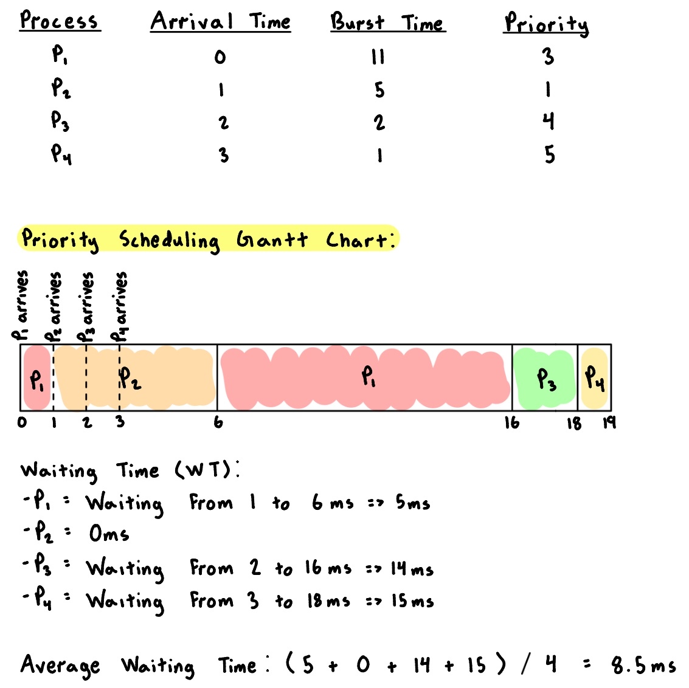

# CPU Scheduling

In a single-processor system, only one process can run at a time. Other processes must wait until the CPU becomes free. For example, a process runs until it must wait (often due to an I/O request). During I/O, the CPU sits idle and all the waiting time is wasted; no useful work is completed.

With **multiprogramming**, the OS can switch the CPU to another process during waiting to keep the system productive.

The **objective of multiprogramming** is to keep the CPU busy at all time, to **maximize CPU utilization**.

---

# CPU–I/O Burst Cycle

Process execution consists of a cycle of **CPU execution (CPU burst)** and **I/O wait (I/O burst)**.

<p align="center">  </p>

- **CPU burst**: The time spent when the process is in CPU execution  
- **I/O burst**: The time spent when the process is in I/O wait
- A process usually executes on the CPU first then usually needs to perform some I/O

> **Main Observation**: **CPU burst distribution** is of primary concern for scheduling.

---

# Preemptive and Non-Preemptive Scheduling
CPU scheduling can be categorized into two approaches based on whether the kernel is preemptive or not.
- **Prempetive:** The kernel allows a process to be preempted (interrupted and replaced) in kernel mode.  
- **Non-Preemptive:** Once a process enters kernel mode, it continues to execute until its exits, blocks, or voluntarily yields the CPU.  
    - Advantage: Essentially free of race conditions in kernel mode.  

## Short-term Scheduler
Whenever the CPU becomes idle, the OS must pick a process from the ready queue to execute. This selection is done by the **short-term scheduler**. The scheduler selects a process from the process in memory that are ready to execute and allocates the CPU to that process.
- In **non-preemptive systems**, it is invoked only when the current process **finishes** or **blocks**.  
- In **preemptive systems**, it can also be triggered by **interrupts** or **priority changes**, allowing the OS to switch processes even while one is running.  

## Dispatcher
The dispatcher module gives gives **control of the CPU** to the chosen process. It handles:
- Context switching  
- Switching to user mode  
- Jumping to correct user instruction  

**Dispatch Latency**: The time taken to stop one process and start another.

Both **preemptive** and **non-preemptive** systems use the dispatcher, the difference is simply **how often** it is invoked.  

## CPU Decision Points

Scheduling occurs when a process:
1. Switches from **running → waiting**  
2. Switches from **running → ready** (interruption)  
3. Switches from **waiting → ready** (I/O completion)  
4. **Terminates**

### Types
- **Scheduling under Cases 1 & 4** → No choice in terms of scheduling, a new process in the ready queue must be selected for execution. Corresponds to **non-preemptive** scheduling events.  
- **Scheduling under Cases 2 & 3** → A process must be chosen from the ready queue based on some selection method. Corresponds to **preemptive** scheduling events.  

---

# Scheduling Criteria

1. **CPU Utilization:** We want to keep the CPU as busy as possible  
   - CPU utilization can range from 0–100%  
   - Lightly loaded systems utilizes up to ~40% CPU  
   - Heavily loaded systems utilizes up to ~90% CPU

2. **Throughput:** Number of processes that complete their execution per time unit

3. **Turnaround Time:** Amount of time to execute a particular process (from submission → completion) 
   - Includes wait time (into memory and in the ready queue), CPU execution, I/O

4. **Waiting Time:** Amount of time a process has been waiting in the ready queue  

5. **Response Time:** Amount of time it takes from when a request was submitted until the first response (not completion) is produced


## Scheduling Algorithm Optimization Criteria
- **Maximize**:
  - CPU utilization
  - Throughput
- **Minimize**:
  - Turnaround time
  - Waiting time
  - Response time
$P_2$ to $P_5$ all have the same priority. The process that requests the CPU first is allocated the CPU first. The implementation of FCFS policy is easily managed with a FIFO queue. When a process enters the ready queue, its PCB is linked onto the tail of the queue. When the CPU is free, it is allocated to the process at the head of the queue.

---

# Process Scheduling Algorithms

## First-Come First Served (FCFS) Scheduling

```
P1 → running  

    P2 ← P1   [P2 > P1]  
    P3 ← P1   [P3 > P1]  
    P4 ← P1   [P4 > P1]  
    P5 ← P1   [P5 > P1]  
```

Processes $P_2$ through $P_5$ come along all with the some priority greater than $P_1$. In this case, the CPU is allocated based on the **First-Come, First-Served (FCFS)** policy meaning the process that requests the CPU earliest will run first.  

**Key Idea:** The process that requests the CPU first is allocated the CPU first.

**Implementation:** 
- Implemented using a FIFO queue
- When a process enters the ready queue, its PCB is linked onto the tail of the queue
- When the CPU is free, it is allocated to the process at the head of the queue
- Default nature is **non-preemptive** (once a process starts execution, it cannot be interrupted until completion)

### Example 1

<p align="center">  </p>

### Example 2 

<p align="center">  </p>

## Shortest-Job-First (SJF) Scheduling
As seen in the previous examples, the average waiting time in FCFS scheduling can be quite high. To reduce this, a more efficient approach called **Shortest Job First (SJF)** scheduling was introduced.

**Key Idea:** Associate with each process the length of its **current/remaining CPU burst**. Then, we use these lengths to schedule the process with the **shortest CPU burst time** first. If two processes have the same burst time, **FCFS** is used to break the tie.
- Default nature is also **non-preemptive**

**Optimality:** SJF is **optimal** because it provides the **minimum average waiting time** for a given set of processes.

### Example 1

<p align="center">  </p>

### Example 2 

Up to this point, we’ve assumed that all processes arrive at the same time. However, in real systems, processes often **arrive at different times**. To account for this, we introduce the concept of **arrival time**, which represents when each process enters the ready queue. Let’s see how this affects the way the CPU schedules processes.

<p align="center">  </p>

## Priority Scheduling

**Key Idea:**
1. Each process is assigned a **priority number** (an integer).
2. The CPU is allocated to the process with the **highest priority**.  
    - By convention, the **smallest integer = highest priority**.

**Implementation (Two Modes):**
  - **Preemptive Priority Scheduling:** If a new process arrives with higher priority, it preempts the currently running process
  - **Non-preemptive Priority Scheduling:** Once a process starts execution, it continues until completion (no preemption)

> SJF is essentially a special case of Priority Scheduling. In SJF, the priority is the **inverse of the predicted next CPU burst time** (shorter jobs are treated as higher priority).

**Problem:** Starvation as kow-priority processes may never get CPU time if higher-priority processes keep arriving.  

**Solution:** Aging &mdash; as time progres, gradually increase the priority of processes that wait in the system for a long time so that low-priority processes eventually execute. 

### Example

<p align="center">  </p>

## Round Robin Scheduling

## Multilevel Queue Scheduling

