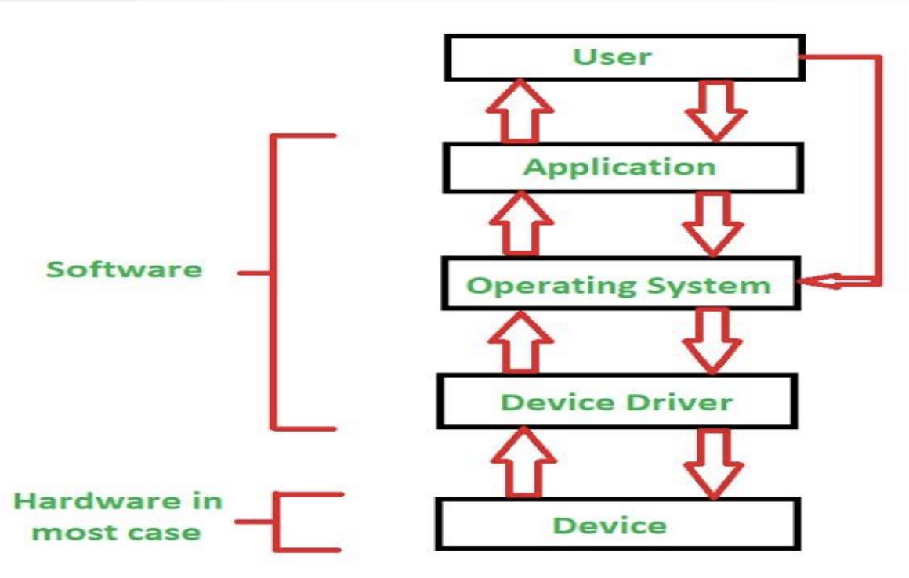

# Device Drivers

A **device driver** is a specialized software that operates a particular computer-connected device. It offers a software interface to the hardware, allowing operating systems and other computer applications to access hardware functionalities.

**In short:**  
A *device driver* is a piece of software that allows the OS to communicate with hardware devices.

> Think of it as a translator between the OS kernel and the hardware.

## User-Kernel Interaction Path

The interaction between users and hardware devices follows a specific path through the system layers:

<p align="center">  </p>

- Users → User Process → System Call → Kernel → Driver → Device (Hardware)

Hardware devices like keyboard, mouse, display, disk, network card all use use drivers to communicate with the OS.

## Why Operating Systems Need Drivers

**Goal:** Modularity and Portability—the primary goal of device drivers is to connect to OS modularity and portability.

- **Without drivers, the OS must know the details of every device**. This would result in:
    - Extremely complex kernel code
    - Hardware-specific implementations embedded in the kernel
    - Difficult maintenance and updates
    - Poor scalability for new hardware

- **Drivers also abstract device-specific logic so that the kernel stays generic**.

- Device drivers creates a **modular structure**:
    - **Core OS** (same across hardware) - Generic kernel functionality
    - **Device-specific modules** (drivers) - Hardware-specific implementations

**Example:** Same Linux kernel can run on Intel, AMD, or ARM because of modular driver model.

## Types of Device Drivers

Device drivers can be categorized based on how they handle data transfer:

> On Unix systems, devices are exposed as special files under `/dev` directory. Listing `/dev` shows the device nodes managed by drivers on the system.

### Character Devices

A **character device** transfers data one byte at a time in a sequential stream.

**Characteristics:**
- **Data Access**: Byte-by-byte (like a stream)
- **Buffering/Seeking**: No random access; read/write sequentially
- **Interface**: `read()`, `write()`, `ioctl()`
- **Device Files**: `/dev/ttyS0`, `/dev/random`

**Examples:**
- Keyboard, mouse, serial ports
- Used for input/output operations like reading from keyboard or writing to serial port

### Block Devices

A **block device** transfers data in fixed-size blocks (usually 512 bytes or more) and supports random access.

**Characteristics:**
- **Data Access**: Block-by-block (fixed-size chunks, typically 512B+)
- **Buffering/Seeking**: Supports random access, seek operations
- **Interface**: `read_block()`, `write_block()`, `fsync()`
- **Device Files**: `/dev/sda`, `/dev/sdb1`

**Examples:**
- Hard drives, SSDs, USB storage
- Used for storage operations requiring random access

---

# Key Functions of a Driver

Every device driver must implement three essential functions:

1. **Initialize and register itself with the kernel**
2. **Handle system calls** like `open()`, `read()`, `write()`, and `ioctl()`
3. **Clean up resources** when unloaded

## Driver Lifecycle

A Linux driver typically follows this lifecycle:

### 1. Load Phase
- Driver is loaded using `insmod` or automatically by `udev`
- Calls `init_module()` or, in modern kernels, `module_init()` function

### 2. Operate Phase
- Driver handles system calls from user programs through the `file_operations` structure
- Processes I/O requests and manages hardware interactions

### 3. Unload Phase
- When the driver is removed (`rmmod`), `cleanup_module()` or `module_exit()` is called
- Resources are freed and hardware is properly shut down

---

# Core Components

## Module Attributes

`__init` and `__exit` tell the compiler that these functions are only used during load/unload.

```c
// Initialization Function
static int __init my_init(void) {
    /* setup code */
    return 0;
}

// Cleanup Function
static void __exit my_exit(void) {
    /* cleanup */
}

module_init(my_init);
module_exit(my_exit);
```

## User Program Interaction

### Opening a Device
When a user program runs:
```c
fd = open("/dev/mydriver", O_RDONLY);
```
**Kernel calls driver's `my_open()` function**

### Reading from a Device
When a user program runs:
```c
read(fd, buf, 100);
```
**Kernel calls driver's `my_read()` function**

### `file_operations` Implementation

The `struct file_operations` defines the interface between the kernel and driver:

```c
#include <linux/module.h>
#include <linux/fs.h>

static int my_open(struct inode *inode, struct file *file) { return 0; }

static int my_release(struct inode *inode, struct file *file) { return 0; }

static ssize_t my_read(struct file *file, char __user *buf, size_t len, loff_t *offset) { return 0; }

static struct file_operations fops = {
    .open = my_open,
    .release = my_release,
    .read = my_read,
    .........
};
```

## Complete Driver Implementation

```c
// Initialization and Registration
static int __init my_init(void) {
    register_chrdev(240, "mydriver", &fops);
    printk(KERN_INFO "Driver loaded!\n");
    return 0;
}

// Cleanup and Unregistration
static void __exit my_exit(void) {
    unregister_chrdev(240, "mydriver");
    printk(KERN_INFO "Driver unloaded!\n");
}

module_init(my_init);
module_exit(my_exit);
MODULE_LICENSE("GPL");
```
- **`register_chrdev()`**: Registers a character device with the kernel
- **Major Number (240)**: Identifies the device type
- **Device Name ("mydriver")**: Human-readable identifier
- **File Operations (&fops)**: Pointer to function implementations 