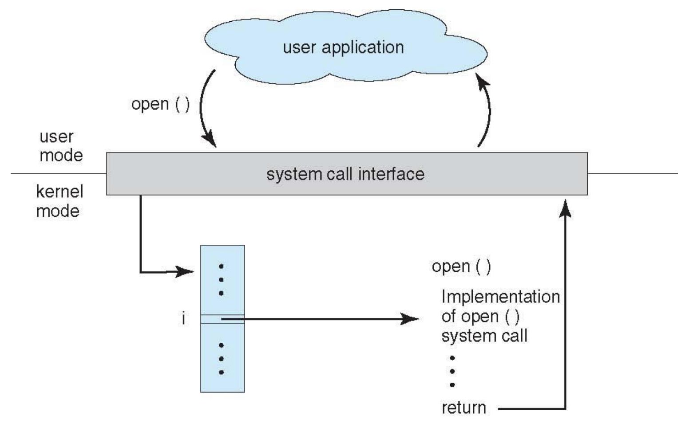
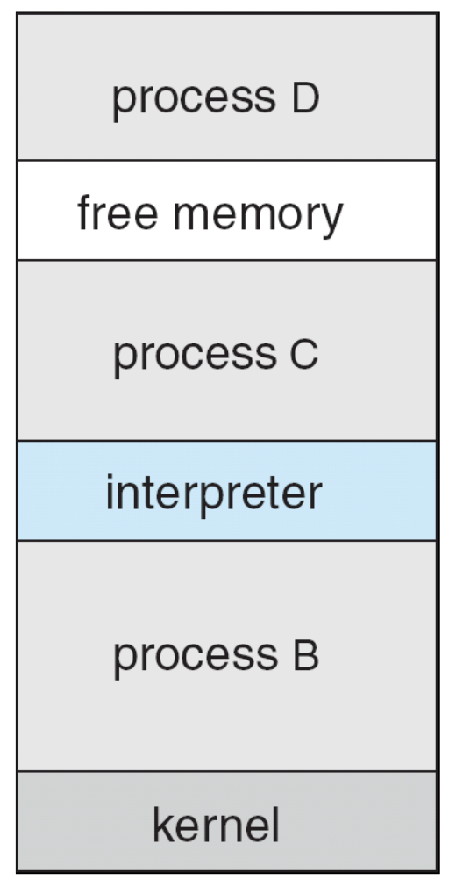

# Operating System Services

Operating systems provide the **environment** for running programs and serving users. They act as an intermediary between **hardware** and **applications**, offering essential services that make computers usable.

## OS Services Helpful to Users

### User Interface (UI)
Almost all operating systems provide a user interface.  
- **Command-Line Interface (CLI)**   
- **Graphical User Interface (GUI)** 
- **Batch Interface** – Users submit jobs (programs + data) to be executed without direct interaction.  

### Program Execution
The OS must support running programs:
- Load program → into memory  
- Execute program → provide CPU scheduling & control  
- End execution → normally or abnormally  

### I/O Operations
Programs often need input/output:
- Examples: reading a file, writing output, sending data to a printer, accessing a disk.  

The OS provides a **uniform interface** so programs don’t need to know the details of the hardware.  

### File-System Manipulation
The **file system** is crucial because most programs need to read and write files and directories, create and delete them, search them, list file information, and handle permissions.

### Communications
Processes often need to **exchange data**:
- **On the same computer** (e.g. shared memory or message passing)  
- **Across computers** (e.g., network packets)  

### Error Detection
Errors can occur in:
- CPU/memory hardware  
- I/O devices 
- User programs  

The OS must:
- Detect errors  
- Take corrective action  
- Provide debugging tools  

## Services for System Efficiency

### Resource Allocation
When multiple users or jobs run together:
- OS decides how to share resources: **CPU cycles, memory, storage, I/O devices**  
- Goal = maximize fairness and efficiency.  

### Accounting
The OS keeps track of:
- Which users/programs use how many resources  
- Useful for **billing, quotas, performance tuning**  

### Protection and Security
In a multi-user or networked environment:
- **Protection**: Ensure processes cannot interfere with each other  
- **Security**: Defend against outsiders (internal and external threats) 
  - Requires user authentication  
  - Guards against invalid access to devices/files  

## A Unified View of OS Services

The OS is layered between **hardware** and **user programs**.

  

- **User interfaces** (CLI, GUI, batch) sit at the top  
- **System calls** form the bridge, letting programs request OS services  
- **Core services** (execution, I/O, file systems, communication, resource allocation, error detection, protection, accounting) are provided by the OS  
- At the bottom, the OS manages the **hardware**  

---

# User Operating System Interfaces

Again, operating systems allow users to interact with the system through **interfaces**.  

## Command-Line Interface (CLI)

A **CLI** (**command interpreter**) allows direct text-based command entry.

- **Implementation**:  
  - Sometimes built directly into the **kernel**  
  - Other times provided as a **system program** (separate layer)  

- **Shells**: CLI can come in multiple flavors i.e. **shells** e.g. Bash, Zsh, PowerShell.  
  - Shells fetch a command from the user → interpret it → execute it  

- **Commands**:  
  - Some are **built-in** i.e. handled inside the shell itself
  - Others are **external programs** i.e. shell just calls them
    - Advantage: Adding new features doesn’t require modifying the shell   
  - [`zsh` Commands](https://zsh.sourceforge.io/Doc/Release/Shell-Builtin-Commands.html)

### Example: Bourne Shell

The **Bourne Shell (sh)** is one of the earliest and most influential Unix shells. It provides a **command-line interface** where users type commands that the shell interprets and executes.

  

**Example session (screenshot above):**
- `w` → shows logged-in users and system load averages  
- `iostat 5` → displays CPU and disk I/O stats every 5 seconds  
- `ls` → lists files and directories in the current location  
- `pwd` → prints the current working directory (`/Users/pbg`)  
- `ping 192.168.1.1` → tests network connectivity with round-trip times  

## Graphical User Interface (GUI)
The **GUI** was invented at **Xerox PARC** and popularized in commercial systems.
- Uses the **desktop metaphor**: screen as a “desktop,” icons as documents/programs  
- **Devices**: Typically requires mouse, keyboard, and monitor  
- **Icons**: Represent files, actions, or folders  
- **Mouse actions**: Clicking, double-clicking, right-clicking = different operations  

GUIs made computers **accessible to the masses** by replacing text commands with visuals.

### GUI and CLI in Modern Systems
- **Microsoft Windows**: Primarily GUI, but includes a CLI (`cmd`, PowerShell)  
- **Apple Mac OS X**: “Aqua” GUI layered on top of UNIX kernel; shells also available  
- **Unix/Linux**: Traditionally CLI, but optional GUIs (GNOME, KDE, etc.)  

Most modern systems now support **both CLI and GUI** to give flexibility.

#### Example: Mac OS X GUI

  

Apple’s **older Mac OS X GUI**, known as **“Aqua”**, was one of the first polished, consumer-friendly graphical interfaces on top of a UNIX-based system.  

Showcases how early Mac OS X emphasized a **multi-window, multitasking environment** that was both **visually intuitive** and **user-friendly**, in contrast to text-based CLI systems.

## Touchscreen Interfaces

With smartphones and tablets, OS interfaces evolved further:
- No mouse → rely on **gestures** (tap, swipe, pinch)  
- Virtual **on-screen keyboard** for text input  
- Increasing use of **voice commands** (Siri, Google Assistant)  

---

# System Calls

System calls are the **programming interface** through which applications request services from the operating system.

## What Are System Calls?

- Provide a **bridge** between user programs and OS services  
- Typically written in high-level languages (C, C++)  
- Most programs access system calls indirectly through **APIs (Application Programming Interfaces)** rather than invoking raw system calls  
- Common APIs:
  - **Win32 API** → Windows  
  - **POSIX API** → Unix/Linux/Mac OS X  
  - **Java API (JVM)** → for Java programs  

## Example of System Calls (File Copy)

System call sequence to copy a file from **source** to **destination**:

  

Even a simple operation like copying a file requires multiple system calls for I/O, error handling, and messaging.

## Example of a Standard API: `read()`

In Unix/Linux, `read()` is a standard API for reading from a file:

  

This demonstrates how APIs give a **clean function call**, but underneath it triggers system calls in the OS.

## System Call Implementation

- Each system call is assigned a **number**  
    - **System Call interface** maintains an indexed table mapping numbers → system call routines  
- The system call interface invokes the intended system call in the OS Kernel and returns the status of the system call and any return values.  
- The caller need know nothing about how the system call is implemented.
    - The caller only needs to obey the API which hides most details of the OS interface (managed by **run-time support libraries** which are a set of functions provided with the compiler).  

### Example: API – System Call – OS Relationship

  

- **User application** calls `open()`  
- API passes request to **system call interface**  
- OS kernel executes the system call, returns result  

## System Call Parameter Passing

System calls often need more information (filenames, sizes, addresses). Parameters can be passed in three main ways:

1. **Registers** → simplest, but limited in number  
2. **Memory Block/Table** → parameters stored in memory, OS gets address (Linux/Solaris use this)  
3. **Stack** → parameters pushed by program, popped by OS  

_Note:_ Block and stack methods allow flexible parameter sizes

### Example: Parameter Passing via Table

  

- The user program prepares the parameters for a system call (in this case, system call 13) and places them in a block of memory (the table `X`)  
- The address of this table (X) is then loaded into a register  
- The user program issues the instruction `system call 13`, which transfers control to the operating system  
- The operating system uses the address stored in the register to locate the table and read the parameters stored there  
- With the parameters retrieved, the OS executes the code for system call 13

## Types of System Calls
System calls are grouped by the kind of service the operating system provides.  

### Process Control
**Process Control Calls** let the OS start, stop, and coordinate processes. Without these calls, multitasking would not be possible.  

- Create process, terminate process  
- End, abort  
- Load, execute  
- Get/set process attributes (e.g., priority, scheduling info)  
- Wait for time  
- Wait/signal event (synchronization)  
- Allocate and free memory  
- Dump memory if error (debugging support)  
- Debugger hooks to detect bugs and step through execution  
- Locks to prevent race conditions on shared resources  

### File Management
**File Management Calls** give programs persistent and structured access to data. The OS transforms raw storage into a file abstraction so that applications can read and write consistently.  

- Create file, delete file  
- Open, close file  
- Read, write, reposition (move file pointer)  
- Get/set file attributes (permissions, size, owner, timestamps)  

### Device Management
**Device Management Calls** abstract diverse hardware devices through a common interface so from the program’s perspective, devices behave like files, hiding hardware-specific details.  

- Request device, release device  
- Read, write, reposition  
- Get/set device attributes (e.g., printer mode, disk block size)  
- Logically attach or detach devices  

### Information Maintenance
**Information Maintenance Calls** allow programs to query or adjust the system state. These calls give visibility into the environment in which processes execute.  

- Get/set time or date  
- Get/set system data (e.g., OS version, available memory)  
- Get/set process, file, or device attributes  

### Communications
**Communication Calls** enable processes to exchange information, either on the same machine or across a network.  

- Create/delete communication connection  
- Send/receive messages (client-server interaction)  
- Create and access shared memory regions  
- Transfer status information  
- Attach/detach remote devices  

### Protection
**Protection Calls** enforce security and controlled access in a multi-user or multi-process system ensuring that processes cannot interfere with one another and that users only access what they are permitted to.  

- Control access to resources  
- Get/set permissions  
- Allow or deny user access  

### Example: Windows and Unix System Calls

  

Windows and Unix provide similar functionality but use different naming conventions.

### Example: Standard C Library

  

- Program calls `printf("Greetings");` → looks like a library call  
- Underneath, `printf` calls the `write()` system call to send characters to the output device  
- Flow: User program (in user mode) → Standard C library → `write()` system call → Kernel mode → Output device  

Library calls are often **wrappers around system calls**, making them easier for programmers.

### Example: System Calls in MS-DOS 

MS-DOS shows how a very simple and single-tasking OS handles program execution with minimal use of system calls.

  

- At boot, the shell runs and loads a program into memory  
- No process abstraction: the program overwrites all memory except for the kernel  
- When the program exits, the shell is reloaded  

### Example: System Calls in FreeBSD OS (Unix variant)
FreeBSD illustrates how a modern, multitasking OS relies heavily on system calls to manage processes.

  

- User login invokes the chosen shell  
- Shell calls `fork()` to create a new process  
- New process then uses `exec()` to load a program into memory  
- The shell waits until the process finishes, then continues with new user commands  
- Process exits with:
  - `0` = success  
  - >0 = error code  

---

# System Programs

While **system calls** provide the low-level interface to the OS kernel, **system programs** build on top of them to provide a convenient environment for users and developers.  
- Most users interact with the OS through these programs, not by calling system calls directly.

## Types of System Programs

System programs can be divided into several categories:

### File Management
System programs simplify file manipulation tasks by wrapping system calls in user-friendly tools. They allow users to create, delete, copy, rename, list, or print files and directories.

Examples:  
- `cp`, `mv`, `rm`, `ls` in Unix/Linux  
- Windows File Explorer  

### Status Information
System programs report information about the system’s current state. This can range from basic values (date, time, disk space) to detailed performance logging and debugging.

- Examples: `top`, `ps`, `df` in Unix/Linux  
- Windows Task Manager  

Some systems also provide a registry to store and retrieve configuration data (Windows Registry).

### File Modification
These programs allow users to create and modify file contents, providing higher-level abstractions beyond simple read/write system calls.

- Text editors like `vim`, `nano`, or Notepad  
- Special commands for searching or transforming text  

### Programming Language Support
Compilers, assemblers, debuggers, and interpreters belong here. They translate high-level programs into machine instructions and provide debugging tools.

- Examples: `gcc` (C compiler), `gdb` (debugger), Java Virtual Machine (interpreter)  

Without these programs, writing new applications would mean interacting with the OS in raw machine code.

### Program Loading and Execution
Programs that handle how code is brought into memory and executed which includes loaders, linkage editors, and debuggers.
- Absolute loaders: load machine code at fixed addresses  
- Relocatable loaders: adjust code to different memory locations  
- Overlay loaders: swap program segments into memory as needed  

### Communications
Programs that let users and processes exchange information. They implement communication interfaces on top of OS primitives like sockets, pipes, and shared memory.

Examples:  
- Sending messages between one users' screen to another  
- Browsing the web, sending email  
- Remote login (`ssh`) and file transfer (`ftp`, `scp`)  

### Background Services
Also called **services**, **subsystems**, or **daemons** (in Unix). They run in the background to provide ongoing functionality.

- Some run only at boot time   
- Others persist from boot to shutdown (logging, scheduling, printing, disk checking)  
- They operate in user context, not kernel context, though tightly integrated with the OS  

Examples:  
- `cron` (Unix scheduler)  
- Windows Service Control Manager  

These services are often invisible to users but essential for smooth system operation.

### Application Programs
Not technically part of the operating system, but typically bundled with it, since they are launched through the same interfaces (command line, menu, mouse click).

- Examples: web browsers, office suites, media players.  

Though not system-level, their seamless integration with OS utilities means many users blur the line between **“system programs”** and **“applications.”**