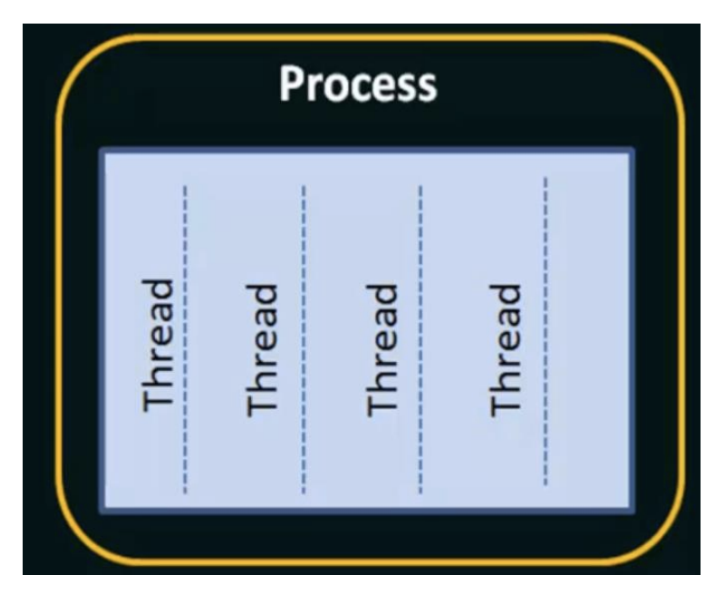
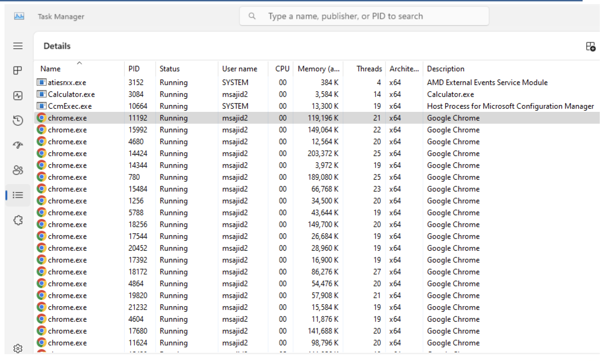
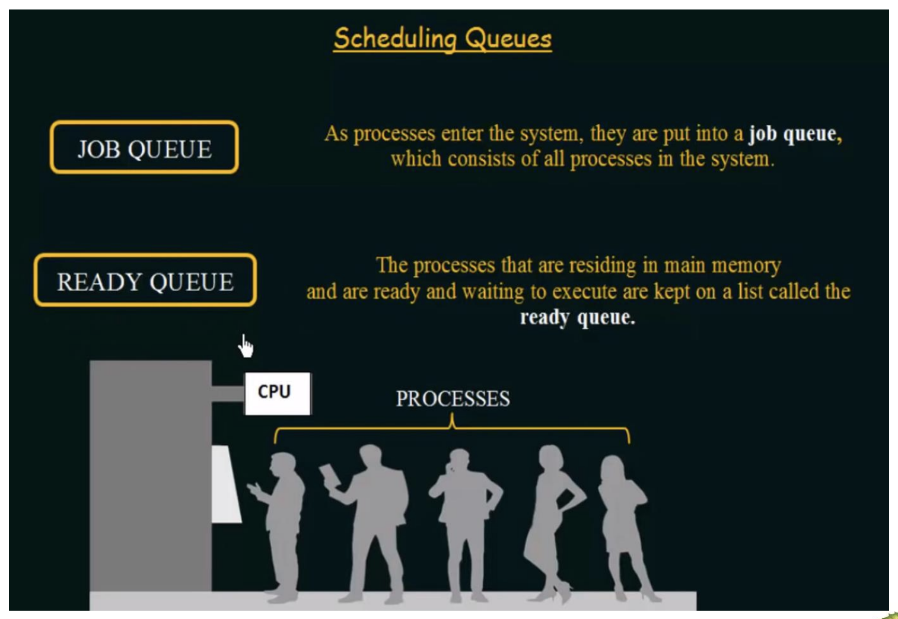
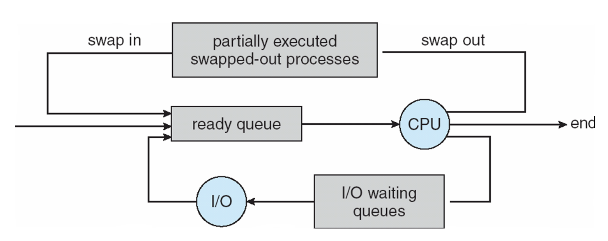
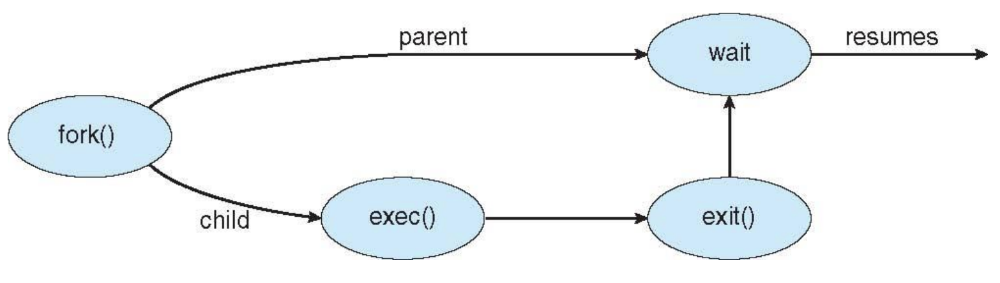

# Process Concept
The operating system executes a variety of programs:  
- **Batch systems** run *jobs* submitted by users  
- **Time-shared Systems** run *user programs (tasks)*, allowing multiple users to interact with the system simultaneously  

> Textbooks often use **job** and **process** interchangeably, but in modern OS theory, a **process** specifically means *a program in execution*.

A process consists of several parts:  
- **Text Section:** The program code itself  
- **Program Counter & Registers:** Track the current execution state  
- **Stack:** Temporary data such as function parameters, return addresses, local variables  
- **Data Section:** Global variables  
- **Heap:** Contains memory dynamically allocated at runtime  

---

<p align="center">
  
</p>

# Program vs Process
- A **program** is a passive entity (an executable file) stored on disk.  
- A **process** is an active entity, created when the program is loaded into memory.  
  - *Important:* Multiple processes may be created from a single program (e.g. multiple users running the same program)

Execution can begin through:  
- GUI actions (mouse click, double-click)  
- CLI commands (typing program name)  

---

# Threads
A **thread*** is the unit of execution within a process.
- Traditionally, each process has **one program counter**, meaning only one sequence of instructions could execute at a time.  
- By introducing **multiple program counters**, different parts of the process can run simultaneously.  
- These **multiple threads of control** are called **threads**.  

<p align="center">
  
</p>

*Note:* More to be discussed next section/chapter.

---

# Example: Program, Process, Threads

<p align="center">
  
</p>

---

# Process State
As a process executes, it transitions between states:

<p align="center">
  
</p>

A process begins in the **New** state, where it is created but not yet admitted. Once ALL resources are allocated, it enters the **Ready** state, waiting for CPU time.  

When scheduled, it moves to **Running**, where instructions execute on the CPU. From here, it may:  
- Return to **Ready** if preempted.  
- If it issues an I/O or some event, it transitions to **Waiting**. Once the I/O or event completes, the process does not resume running and instead goes back to the **Ready**, since another process may currently occupy the CPU. The scheduler would decide when it runs again based on some priority.  
- All processes eventually finish and transition to **Terminated** where the OS reclaims resourecs.  

---

# Process Control Block (PCB)

The **PCB** (also called *Task Control Block*) is the OS’s data structure for managing processes. Each process has a PCB that contains:

<p align="center">
  
</p>

- **Process State** (running, waiting, etc.)  
- **Process Number — PID** (unique identifier)  
- **Program Counter** (location of next instruction to execute)  
- **CPU Registers** (contents of all process-centric registers)  
- **CPU Scheduling Info** (priorities, scheduling queue pointers)  
- **Memory Management Info** (memory allocated to the process)  
- **Accounting Info** (CPU usage, clock time elapsed since start, time limits, etc)  
- **I/O Status Info** (I/O devices allocated, list of open files)  

The PCB is crucial because it lets the OS **pause** a process (context switch), save its state, and later **resume** it as if it was never interrupted.

---

# Context Switch  

A **context switch** occurs when the CPU changes from executing one process to another. To do this safely, the system must **save the state** of the currently running process and later **reload that state** so the process can resume from the exact point it left off.  
- The saved information, known as the **context**, is stored in the **Process Control Block (PCB)**. 

Context switching is a form of **overhead**: while the system is saving and restoring states, no actual work (no user process execution) is being done. As a result, efficiency decreases with more frequent switches.  

The complexity of the **OS** and the size of the **PCB** directly influence how long a context switch takes. More complex systems (with larger contexts to save and restore) lead to longer switch times.  

## Example: CPU Switch from Process to Process (Single Processor CPU)

<p align="center">
  
</p>

There are two processes. $P_0$ is executing, but a higher-priority $P_1$ arrives. $P_1$ cannot run immediately — the OS must first save $P_0$’s state into $PCB_0$ and then reload the state from $PCB_1$ so $P_1$ can execute.  

Later, when $P_0$ regains priority, the OS saves $P_1$’s state into $PCB_1$ and reloads $P_0$’s state from $PCB_0$.  

This switching allows both $P_0$ and $P_1$ to resume exactly where they left off.  

---

# Process Scheduling

The objective of **multiprocessing** is to keep the CPU busy at all times by ensuring some process is always running.  

The objective of **timesharing** is to switch the CPU frequently among processes so users can interact with programs in real time.  

The **process scheduler** selects a process from the pool of available ones and decides which executes on the CPU next.  
**Process scheduling** is the mechanism that determines the execution order of processes.  

## Scheduling Queues

The processor schedular maintes scheduling queues of processes:  

- **Job Queue**: Set of all processes in the system (always has everything) 
- **Ready Queue**: Set of all processes residing in main memory, ready and waiting for CPU.  
- **Device (I/O) Queues**: Set of processes waiting for an I/O device.  

Processes migrate among these queues depending on whether they need CPU, I/O, or are waiting to be admitted.  

<p align="center">
  
</p>

### Diagram of Scheduling

<p align="center">
  
</p>

Suppose process $P_0$ is running on the CPU with all its required resources. Then, a higher-priority process $P_1$ arrives. Since $P_1$ must be given the CPU, $P_0$ is **swapped out** of memory before finishing. At this point, $P_0$ is considered **partially executed**. When resources free up, $P_0$ is **swapped back in**, placed into the ready queue, and can eventually continue execution on the CPU from where it left off.  


### More Complex Scheduling Diagram (Time Slice)

<p align="center">
  
</p>

A process begins in the **ready queue** and is dispatched to the **CPU** for execution. While running, it may issue an **I/O request**, which moves it into the **I/O queue** until the operation completes, after which it returns to the ready queue. If a process exceeds its **time slice**, it is preempted and sent back to the ready queue so another process can run. The CPU can also **fork a child**, creating a new process that enters the system. Finally, an **interrupt** may occur, temporarily halting execution until the interrupt is serviced, after which the process is placed back into the ready queue.  


> **Why Multi-Thread Instead of Multiprocessing?**
>Multithreading allows multiple tasks to run concurrently within the same process. Multiprocessing does the same but across separate processors.  
>
>Multiprocessing has higher overhead and lower efficiency due to process creation, context switching, and communication costs.  
>
>Multithreading is lighter since threads share memory, switch faster, and communicate more efficiently — giving many of the same benefits as multiprocessing with less cost.  
>
> In terms of security, multithreading is riskier because one thread can interfere with another thread (in the same process).

---

# Process Creation

A **parent process** creates one or more **child processes**, forming a **tree of processes**. Each process is identified by a unique **process identifier (PID)**.  

### Resource Sharing
- Parent and children share all resources
- Children share a subset of parent's resources
- Parent and child share no resourecs

### Execution
- Parent and child may execute **concurrently**  
- Parent may also **wait** until children terminate  

### Example: A Tree of Processes in Linux
<p align="center">
  
</p>

- `systemd` (**system daemon**) is the parent process of all the processes.

## Address Space
A child’s memory space can be:  
1. **Duplicate of the parent** (same code/data) 
2. **New program loaded** into its own space  

### UNIX Examples
<p align="center">
  
</p>

- `fork()` → system call creates a new (child) process that duplicates the current process; it returns $1$ for the parent, $0$ for the child, or $-1$ for an error

- `exec()` → system call used after a `fork()` to replace the process’s memory with a new program  

> `fork()` and `exec()` are UNIX system calls and do not exist directly in Windows. Instead, Windows provides the **`CreateProcess()`** API, which combines both steps into a single call.  

#### Example: C Program Forking Separate Process (Linux)
- `fork()` creates a child process.  
  - If the process is the **parent** after the `fork()`, it returns **1**.  
  - If the process is the **child** after the `fork()`, it returns **0**.  
  - If the call fails, it returns **-1**.  

```c
#include <sys/types.h>
#include <stdio.h>
#include <unistd.h>

int main() {
    pid_t pid = fork();

    if (pid < 0) { // Error
        fprintf(stderr, "Fork Failed"); 
        return 1;
    }
    else if (pid == 0) { // Child Process
        execlp("/bin/ls", "ls", NULL);
    }
    else { // Parent Process
        /* will wait for the child to complete */
        wait(NULL);
        printf("Child Complete\n");
    }
    return 0;
}
```

#### Example: Creating a Child Process via Windows API
```c
#include <stdio.h>
#include <windows.h>

int main(VOID)
{
    STARTUPINFO si;
    PROCESS_INFORMATION pi;

    /* allocate memory */
    ZeroMemory(&si, sizeof(si));
    si.cb = sizeof(si);
    ZeroMemory(&pi, sizeof(pi));

    /* create child process */
    if (!CreateProcess(NULL,               /* use command line */
        "C:\\WINDOWS\\system32\\mspaint.exe", /* command */
        NULL,                              /* don't inherit process handle */
        NULL,                              /* don't inherit thread handle */
        FALSE,                             /* disable handle inheritance */
        0,                                 /* no creation flags */
        NULL,                              /* use parent's environment block */
        NULL,                              /* use parent's existing directory */
        &si,
        &pi))
    {
        fprintf(stderr, "Create Process Failed");
        return -1;
    }

    /* parent will wait for the child to complete */
    WaitForSingleObject(pi.hProcess, INFINITE);
    printf("Child Complete");

    /* close handles */
    CloseHandle(pi.hProcess);
    CloseHandle(pi.hThread);
}
```

#### Example: Multiple `fork()` calls
```c
#include <stdio.h>
#include <sys/types.h>
#include <unistd.h>

int main()
{
    fork();
    fork();
    fork();
    printf("COSC 439 \n PID = %d\n", getpid());
    return 0;
}
```

```css
                               P
                 ┌─────────────┴─────────────┐
                 1                           0
           ┌─────┴─────┐               ┌─────┴─────┐
          11           10             01           00
        ┌─┴─┐        ┌─┴─┐          ┌─┴─┐        ┌─┴─┐
      111 110      101 100        011 010      001 000   ← 8 leaves (8 prints)

```
The output appears 8 times because `printf` is executed after the third `fork()`, so there are \(2^3 = 8\) concurrent processes at that point.

> In general, after $x$ sequential `fork()` calls, the number of processes AFTER the $x$-th fork is \(2^x\) (assuming all `fork()` calls are successful).


#### Example: Using exec() to run another program

**ex1.c**:
```cpp
#include <iostream>
#include <unistd.h>
#include <stdlib.h>
using namespace std;

int main(int argc, char *argv[])
{
    printf("PID of ex1.c = %d\n", getpid());
    char *args[] = {"COSC", "439", NULL};
    execv("./ex2", args); // This call replaces this process with the ex2 program if it succeeds. So the code below is actually never reached.
    printf("Back to ex1.c");
    return 0;
}
```

**ex2.c**
```c
#include <stdio.h>
#include <unistd.h>
#include <stdlib.h>

int main(int argc, char *argv[])
{
    printf("we are in ex2.c\n");
    printf("PID of ex2.c = %d\n", getpid());
    return 0;
}
```

#### Example: Logical AND with `fork()`
```c
#include <stdio.h>
#include <sys/types.h>
#include <unistd.h>

int main(void) {
    if (fork() && fork()) {
        fork();
    }
    printf("Hello\n");
    return 0;
}
```

**Result:**

#### Example: Logical OR with `fork()`
```c
#include <stdio.h>
#include <sys/types.h>
#include <unistd.h>

int main(void) {
    if (fork() || fork()) {
        fork();
    }
    printf("Hello\n");
    return 0;
}
```

**Result:**

#### Example: Logical AND + OR with `fork()`
```c
#include <stdio.h>
#include <sys/types.h>
#include <unistd.h>

int main(void) {
    if (fork() && fork()) {         
        if (fork() || fork()) {     
            fork();                 
        }
    }
    printf("Hello\n");
    return 0;
}
```

**Result:**

---

# Process Termination