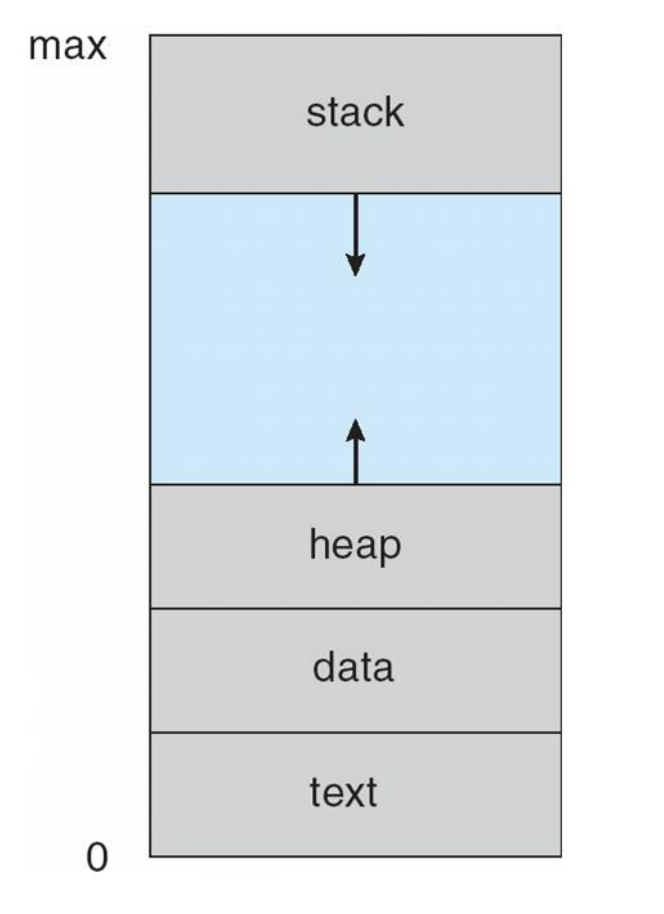
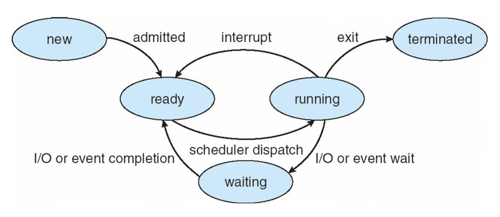
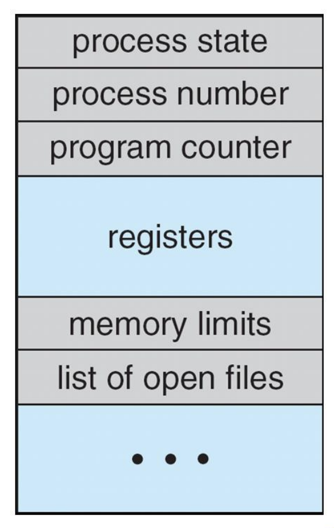

# Processes

## Process Concept
The operating system executes a variety of programs:  
- **Batch systems** run *jobs* submitted by users  
- **Time-shared Systems** run *user programs (tasks)*, allowing multiple users to interact with the system simultaneously  

> Textbooks often use **job** and **process** interchangeably, but in modern OS theory, a **process** specifically means *a program in execution*.

A process consists of several parts:  
- **Text Section:** The program code itself  
- **Program Counter & Registers:** Track the current execution state  
- **Stack:** Temporary data such as function parameters, return addresses, local variables  
- **Data Section:** Global variables  
- **Heap:** Contains memory dynamically allocated at runtime  

<p align="center">
  
</p>

## Program vs Process
- A **program** is a passive entity (an executable file) stored on disk.  
- A **process** is an active entity, created when the program is loaded into memory.  
- Multiple processes may be created from a single program (e.g. multiple users running the same text editor).

Execution can begin through:  
- GUI actions (mouse click, double-click)  
- CLI commands (typing program name)  

## Process State
As a process executes, it transitions between states:

- **New:** Process is being created  
- **Running:** Instructions are executing on the CPU  
- **Waiting:** Process is blocked, waiting for some event to occur  
- **Ready:** Process is assigned to a processor
- **Terminated:** Process has finished execution  

<p align="center">
  
</p>

## Process Control Block (PCB)

The **PCB** (also called *Task Control Block*) is the OS’s data structure for managing processes. Each process has a PCB that contains:

<p align="center">
  
</p>

- **Process State** (running, waiting, etc.)  
- **Process Number (PID)**  
- **Program Counter** (location of next instruction to execute)  
- **CPU Registers** (contents of all process-centric registers)  
- **CPU Scheduling Info** (priorities, scheduling queue pointers)  
- **Memory Management Info** (memory allocated to the process)  
- **Accounting Info** (CPU usage, clock time elapsed since start, time limits, etc)  
- **I/O Status Info** (I/O devices allocated, list of open files)  

The PCB is crucial because it lets the OS **pause** a process (context switch), save its state, and later **resume** it as if it was never interrupted.

### CPU Switch from Process to Process

<p align="center">
  
</p>

## Threads

- Traditionally, each process had **one program counter**, meaning only one sequence of instructions could execute at a time.  
- By introducing **multiple program counters**, different parts of the process can run simultaneously.  
- These **multiple threads of control** are called **threads**.  

> More to be discussed next section/chapter.

---
# TBD

## Process Representation in Linux

In Linux, each process is represented by a **C structure** called `task_struct`. It contains all critical information about the process:

```c
pid_t pid;                /* Process identifier */
long state;               /* Current process state */
unsigned int time_slice;  /* Scheduling information */
struct task_struct *parent;   /* Parent process */
struct list_head children;    /* List of child processes */
struct files_struct *files;   /* List of open files */
struct mm_struct *mm;         /* Memory address space */
```
This structure allows the OS to manage:

- **Hierarchies** (parent/child relationships)  
- **Resource ownership** (files, memory, devices)  
- **Scheduling attributes** (time slices, priority)  

<p align="center">
  
</p>

## Process Scheduling

The goal of scheduling is to maximize **CPU utilization** and **responsiveness** by quickly switching between processes.  

### Process Scheduler
The **scheduler** decides which process gets the CPU next. It maintains **scheduling queues**:

- **Job Queue** – All processes in the system (waiting for some service).  
- **Ready Queue** – Processes in main memory, ready to run on CPU.  
- **Device Queues** – Processes waiting for a particular I/O device.  

Processes can **migrate** between these queues (e.g., waiting for I/O, then back to ready).  

<p align="center">
  
</p>

## Representation of Process Scheduling

A **queueing diagram** illustrates how processes move between the CPU and I/O:  

<p align="center">
  
</p>

- Ready queue → CPU  
- If I/O is requested → goes to I/O queue  
- If a time slice expires → back to ready queue  
- Processes may fork children or wait for interrupts  

This cycle repeats to ensure **fairness and efficiency**.  

## Types of Schedulers

There are different schedulers depending on **when** and **how often** they run:  

### 1. Short-Term Scheduler (CPU Scheduler)
- Chooses which process in **ready queue** runs next.  
- Invoked **frequently** (milliseconds) → must be **fast**.  
- Example: context switching between processes.  

### 2. Long-Term Scheduler (Job Scheduler)
- Controls which processes are admitted into the **system for execution**.  
- Invoked **infrequently** (seconds, minutes).  
- Controls the **degree of multiprogramming** (how many processes are running at once).  

### 3. Medium-Term Scheduler
- Temporarily **removes (suspends)** processes from memory to reduce load.  
- Later **resumes** them when resources are available.  
- Helps balance between **CPU-bound** and **I/O-bound** processes.  

## Process Mix: CPU-Bound vs. I/O-Bound

- **CPU-Bound Process** – Spends most of its time doing computations.  
  - Few, very long CPU bursts.  
- **I/O-Bound Process** – Spends more time waiting for I/O.  
  - Many short CPU bursts.  

A **good process mix** balances both types so the CPU and I/O devices are used efficiently.  
