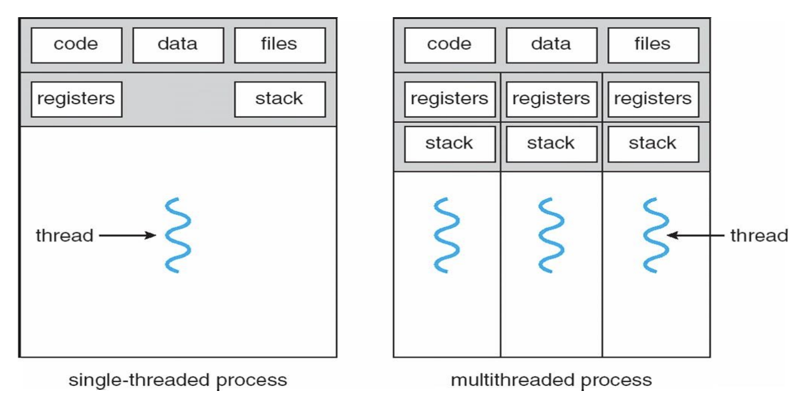
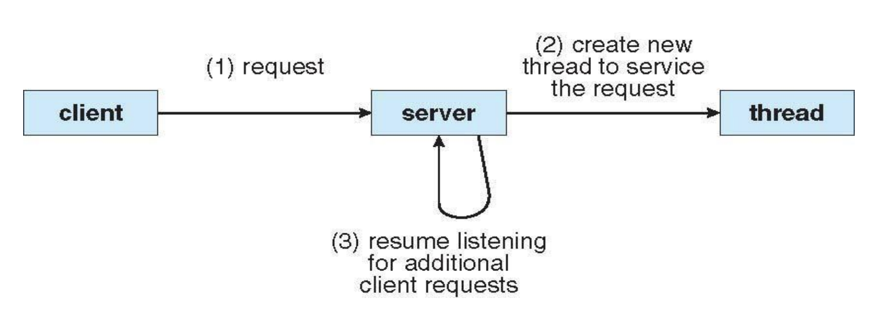
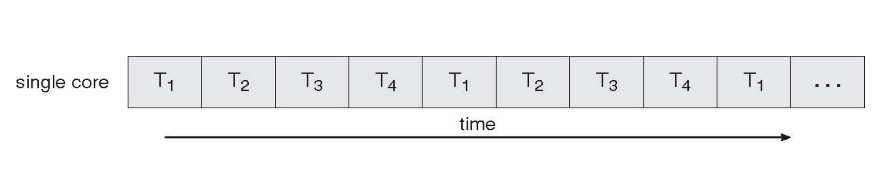
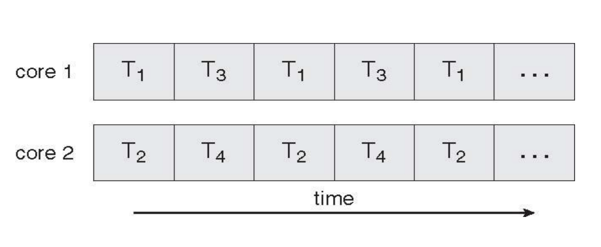
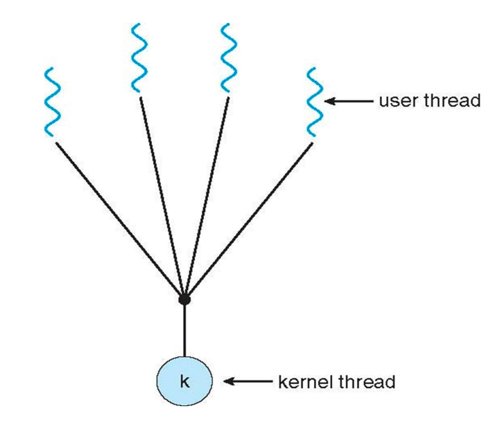
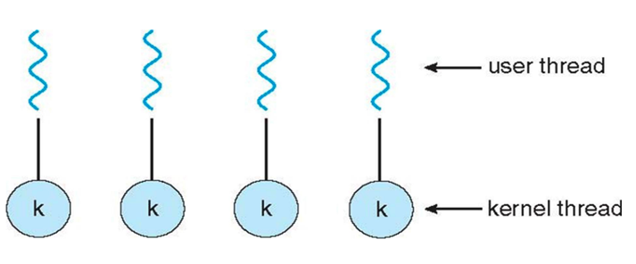
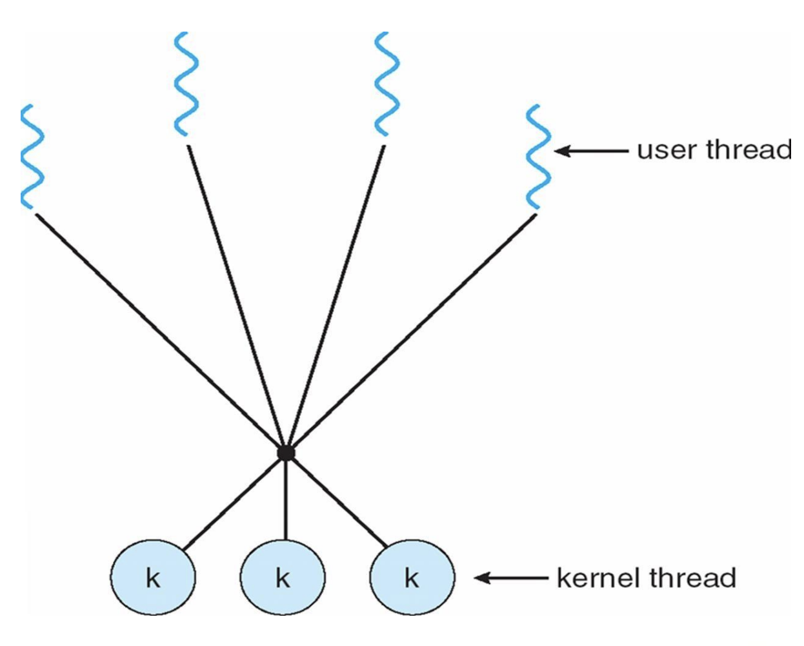
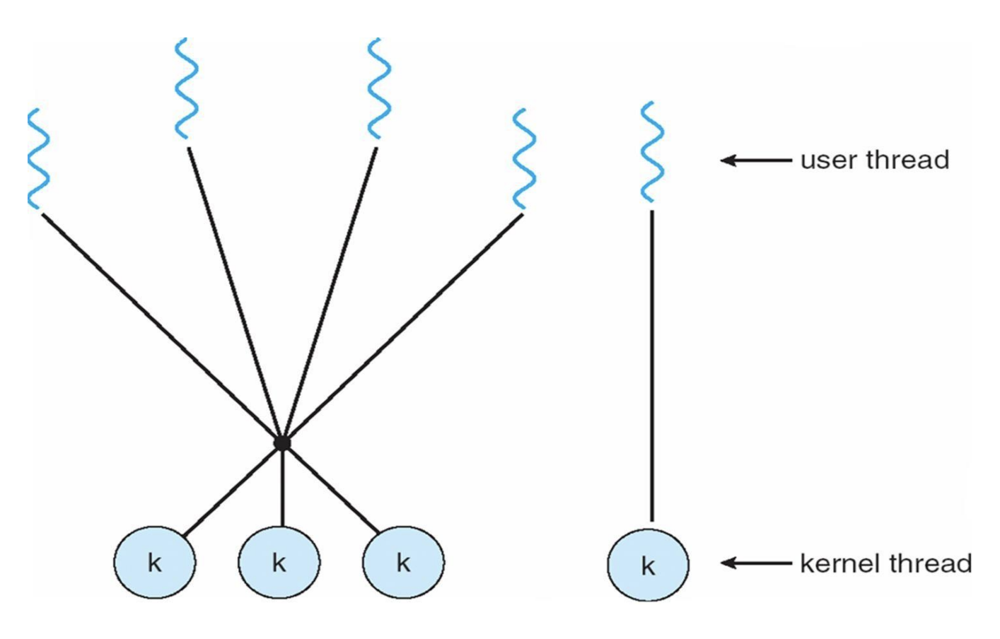

# Motivation
A process can always perform multiple tasks, but can it always do multithreading (parallelized)?  
- If tasks are **synchronous** (dependent on each other), they must run sequentially 
- If tasks are **independent**, they can be implemented as **separate threads**  

Examples of independent tasks in an application:  
- Updating the display  
- Fetching data  
- Spell checking  
- Answering a network request  

Why threads instead of processes?  
- **Process creation is heavy-weight** (requires new memory allocation, PCB creation, etc.)  
- **Thread creation is light-weight** (threads share memory/resources within the same process)  
- Threads can also simplify code and enable modular design thus increasing efficiency  

---

# What is a Thread?
A **thread** is the **basic unit of execution (CPU utilization)** (also called a *lightweight process*).  

A thread consists of:  
- A **Thread ID**  
- A **Program Counter (PC)** (tracks the next instruction)  
- A **Register Set**  
- A **Stack**  

Threads in the same process **share OS resources**:  
- Code section  
- Data section  
- Open files  
- Signals  

## Single-threaded vs Multi-threaded Processes

<p align="center">
  
</p>

- A **single-threaded (heavyweight)** process has **only one thread of control**  
- A **multi-threaded** process has **multiple threads of control** within the same address space and so the process can perform more than one task at a time  

Key points:  
- All threads share **one address space**  
- No memory protection between threads (they can overwrite each other’s data)  
- Multi-threading allows a process to perform **multiple tasks concurrently**  

> Comparison with multiprocessing: Multiprocessing (uses separate processes) accomplishes the same thing as multithreading (multitasking) but multithrading makes use of less resources.

## Benefits of Multithreading
1. **Responsiveness**  
   - Threads provide interactive feedback (e.g. browsers rendering while fetching data) which is achieved through **concurrent execution via IPC**  

2. **Resource Sharing**  
   - Memory/resources shared by default within a process  
   - No explicit IPC needed for communication  

3. **Cost Effective**  
   - Less time-consuming to context-switching and creation compared to process creation which is costly due to full memory/resource allocation  

4. **Utilization of Multiprocessor Architectures**  
   - Threads can run **in parallel on different CPUs**  
   - Maximizes throughput on multi-core systems  

## Examples of Multithreaded Programs
1. **Embedded Systems**  
   - Elevators, planes, medical devices, wristwatches  
   - For elevators, a part of the code is responsible for deciding which elevator is closest and then we can have a thread that executes movement either `up()` or `down()`  

2. **Database Servers**  
   - Handle billions of concurrent queries 
   - E.g. for logging in, threads divide into search ranges (1–100, 101–200, etc); once the target is found in one thread, all other threads terminate  

3. **Network Servers**  
   - Handle concurrent client requests.
   - Examples: file servers, web servers, airline reservation systems  

## Example: Multithreaded Server Architecture

<p align="center">
  
</p>

Typical design for handling concurrent requests:  
1. **Client** sends a request  
2. **Server** spawns a new thread to handle it and immediately returns to listening for more requests  

## Thread State
Threads share certain global state but also maintain private state.  

**Shared across all threads in a process:**  
- Memory contents (global variables, heap)  
- I/O state (file system, network connections)  

**Private to each thread:**  
- This data is stored in the **Thread Control Block (TCB)** e.g.  
    - CPU registers (the program counter) 
    - Execution stack (parameters, temporary variables)  

## Example: Program Counter
```
a = b + c --> Instruction #0 --> Address 001
a = a + a --> Instruction #1 --> Address 002
result = a --> Instruction #2 --> Address 003
```
The **program counter (PC)** holds these addresses in sequence: `001 → 002 → 003`.  Each thread has its own PC to track its independent execution flow.  

---

# Concurrent and Parallel Execution 

## Concurrent Execution on a Single-core System
<p align="center">
  
</p>

- On a single-core system, only one thread executes at a time 
- The OS uses context switching to rapidly switch between threads  
- To the user/programmer, it *appears* as if multiple tasks are happening at once, even though only ONE thread can be executed at any given instant before switching to another thread
- Threads **interleave** in time:  
  - Example timeline: $T_1 \to T_2 \to T_3 \to T_4 \to T_1 \to T_2 \to \dots$  
- Provides **responsiveness** (interactive feel) but not true parallelism  

## Parallel Execution on a Multicore System
<p align="center">
  
</p>

- On a multicore system, each core can execute a thread simultaneously  
- Unlike concurrency, *parallelism is real* — tasks actually run at the same time on different cores. We see:
  - Core 1 runs $T_1, T_3$  
  - Core 2 runs $T_2, T_4$  
- This allows for:  
  - **True parallel throughput** (work done faster)  
  - Scales with the number of cores. 

*Key Point:* You cannot achieve parallel execution on a single-core system.

---

# Thread Libraries

A thread library provides programmers with an API for creating and managing threads.  

Two main implementation approaches:  
- **User-level library**: All thread management is done in user space. The kernel is unaware of threads.  
- **Kernel-level library**: Supported directly by the OS kernel; threads are visible to and managed by the kernel.  

**Main Thread Libraries:**  
- **POSIX Threads (pthreads)**: Portable standard (can be implemented at user-level or kernel-level). Widely used in UNIX/Linux systems 
- **Win32 Threads**: Kernel-level, provided by Windows OS  
- **Java Threads**: Implemented at the user level but mapped internally to native OS threads

## Pthreads (POSIX Threads)
- Can be provided at user-level or kernel-level, depending on OS implementation  
- Global variables are shared among all threads in a process  
- Execution begins in a specific function passed to `pthread_create`  
- Defined in the header file: `<pthread.h>`  
- Available on Solaris, Linux, and macOS  

### Example 1: Simple Sum with pThreads
```c
#include <pthread.h>
#include <stdio.h>
#include <stdlib.h>

int sum; /* shared by thread(s) */
void *runner(void *param); /* thread entry point */

int main(int argc, char *argv[]) {
    pthread_t tid;       /* thread identifier */
    pthread_attr_t attr; /* thread attributes */

    if (argc != 2) {
        fprintf(stderr, "usage: a.out <integer value>\n");
        return -1;
    }
    if (atoi(argv[1]) < 0) {
        fprintf(stderr, "%d must be >= 0\n", atoi(argv[1]));
        return -1;
    }

    pthread_attr_init(&attr);
    pthread_create(&tid, &attr, runner, argv[1]);
    pthread_join(tid, NULL);

    printf("sum = %d\n", sum);
}

/* Thread function */
void *runner(void *param) {
    int i, upper = atoi(param);
    sum = 0;

    for (i = 1; i <= upper; i++)
        sum += i;

    pthread_exit(0);
}
```

This program sum numbers from $1$ to $N$ in a worker thread.  
**Example Flow:**  
1. Run `./a.out 5` → spawns thread with `runner("5")`  
2. Worker computes: 1 → 3 → 6 → 10 → 15 
3. Main waits (`pthread_join`) → prints `sum = 15`  

### Example 2: Joining Multiple Threads
```c
#define NUM_THREADS 10
pthread_t workers[NUM_THREADS];

for (int i = 0; i < NUM_THREADS; i++) {
    pthread_join(workers[i], NULL);
}
```
This program ensures all threads finish before continuing.  
**Example Flow:**  
1. 10 worker threads exist  
2. Main loops: `pthread_join(workers[i])` for each  
3. Guarantees synchronization (no premature exit)  

### Example 3: Computing Partial Sums in Parallel
```c
#include <iostream>
#include <pthread.h>
using namespace std;

int sum1 = 0, sum2 = 0;

void* compute_sum(void* args) {
    int* range = (int*) args;
    int start = range[0];
    int end = range[1];
    int* result = new int(0);

    for (int i = start; i <= end; i++)
        *result += i;

    pthread_exit(result);
}

int main() {
    pthread_t t1, t2;
    int range1[2] = {1, 5};
    int range2[2] = {6, 10};

    pthread_create(&t1, NULL, compute_sum, (void*)range1);
    pthread_create(&t2, NULL, compute_sum, (void*)range2);

    void* result1;
    void* result2;
    pthread_join(t1, &result1);
    pthread_join(t2, &result2);

    sum1 = *(int*)result1;
    sum2 = *(int*)result2;

    delete (int*)result1;
    delete (int*)result2;

    int total_sum = sum1 + sum2;
    cout << "Sum from 1 to 5: " << sum1 << endl;
    cout << "Sum from 6 to 10: " << sum2 << endl;
    cout << "Total sum (1 to 10): " << total_sum << endl;

    return 0;
}
```

This program uses two threads to compute sums over ranges.  
**Example Flow:**  
1. `t1` → computes 1–5 → 15 
2. `t2` → computes 6–10 → 40  
3. Main joins both, combines results: `15 + 40 = 55`  
4. Prints each partial + total 

## Windows Threads
- Provided by the Windows API `<windows.h>`
- Threads are created using `CreateThread`
- Main thread can wait for completion with `WaitForSingleObject`
- Thread resources are cleaned up with `CloseHandle`

### Example: Simple Sum with Windows Threads
```c
#include <windows.h>
#include <stdio.h>

DWORD Sum; /* shared by thread(s) */

/* Thread function */
DWORD WINAPI Summation(LPVOID Param) {
    DWORD Upper = *(DWORD*)Param;
    for (DWORD i = 0; i <= Upper; i++)
        Sum += i;
    return 0;
}

int main(int argc, char *argv[]) {
    DWORD ThreadId;
    HANDLE ThreadHandle;
    int Param;

    if (argc != 2) {
        fprintf(stderr, "An integer parameter is required\n");
        return -1;
    }
    Param = atoi(argv[1]);
    if (Param < 0) {
        fprintf(stderr, "An integer >= 0 is required\n");
        return -1;
    }

    /* Create the thread */
    ThreadHandle = CreateThread(
        NULL, 0, Summation, &Param, 0, &ThreadId);

    if (ThreadHandle != NULL) {
        /* Wait for thread to finish */
        WaitForSingleObject(ThreadHandle, INFINITE);

        /* Close handle */
        CloseHandle(ThreadHandle);

        printf("sum = %d\n", Sum);
    }
}
```

This program sums numbers from $0$ to $N$ in a worker thread.

**Example Flow:**
1. Run `a.exe 5` → main spawns worker thread with `Summation(5)`
2. Worker computes: 0 → 1 → 3 → 6 → 10 → 15
3. Main thread waits (`WaitForSingleObject`)
4. Prints: `sum = 15`

## Java Threads
- Managed by the **Java Virtual Machine (JVM)**.  
- Built on top of the **underlying OS thread model**.  
- Created in two main ways:  
  1. **Extending the `Thread` class**  
  2. **Implementing the `Runnable` interface**  
- Execution begins in the `run()` method.  

---

### Example: Summation with Java Threads
```java
class Sum {
    private int sum;
    public int getSum() { return sum; }
    public void setSum(int sum) { this.sum = sum; }
}

class Summation implements Runnable {
    private int upper;
    private Sum sumValue;

    public Summation(int upper, Sum sumValue) {
        this.upper = upper;
        this.sumValue = sumValue;
    }

    public void run() {
        int sum = 0;
        for (int i = 0; i <= upper; i++)
            sum += i;
        sumValue.setSum(sum);
    }
}

public class Driver {
    public static void main(String[] args) {
        if (args.length > 0) {
            int upper = Integer.parseInt(args[0]);
            if (upper < 0) {
                System.err.println(upper + " must be >= 0.");
            } else {
                Sum sumObject = new Sum();
                Thread thrd = new Thread(new Summation(upper, sumObject));
                thrd.start();
                try {
                    thrd.join();
                    System.out.println("The sum of " + upper + " is " + sumObject.getSum());
                } catch (InterruptedException ie) { }
            }
        } else {
            System.err.println("Usage: Summation <integer value>");
        }
    }
}
```

**Explanation:**
- `Sum` → encapsulates the result
- `Summation` → implements `Runnable`, defines `run()` (actual computation)
- `Driver` → main program:
    1. Reads input `upper`
    2. Creates a `Thread` with a `Summation` task
    3. Starts thread, waits with `join()`
    4. Prints result

**Example Flow (input = 5):**
1. User runs: `java Driver 5`
2. New thread computes: 0 + 1 + 2 + 3 + 4 + 5 = 15
3. Main waits via `join()`
4. Output → The sum of 5 is 15

---

# Threading Issues

## fork() and exec() System Calls

Again, **fork()**:
- Creates a new process (child) identical to the parent  
- Enables parallel processing by creating multiple processes for simultaneous task execution

**exec()**:
- Replaces the current process with a new program  
- Loads the new program into memory, overwriting the old one  
- Initiates execution of the new program from its entry point  
- Commonly used after `fork()` to start a different program in the child process  

*Key Issue:*  Does `fork()` duplicate only the **calling thread** or all threads?  
- Solution: Some UNIX systems have two versions of `fork()`, one that duplicates all threads and another that duplicates only the calling thread
  
**Scenarios:**  
1. If `exec()` is called immediately after `fork()`:  
   - The child process immediately replaces itself with a new program  
   - So, duplicating all threads is pointless since they’d be discarded 
   - **Only the calling thread must be duplicated.**  
    ```
    Parent process P: [ T1, T2, T3 ]
            |
            +-- fork() --------------------------------------+
            |                                                |
            |                                      Child process C: [ T1* ]
            |                                                |
            |                                    exec("new_prog") replaces C
            |                                                v
    Parent keeps running:                          Child now runs NewProgram: [ main ]
    [ T1, T2, T3 ]                                  (original threads discarded)

    ```

2. If `exec()` is *not* called:  
- The child continues running the same program 
- To preserve correct behavior, **all threads must be duplicated**  
    ```
    Parent process P: [ T1, T2, T3 ]
        |
        +-- fork() ----------------------> Child process C: [ T1, T2, T3 ]
                                            (same program continues; all threads duplicated)
    ```

## Thread Cancellation of Target Thread
- **Thread cancellation** = terminating a thread before it has completed.  
- The thread to be canceled is called the **target thread**.  

**Examples:**
- Database searching by concurrent threads: once one worker finds the result, cancel the rest  
- Browser page load: pressing the close button cancels all browsers on the page 

### Two Approaches
1. **Asynchronous Cancellation**  
   - Terminates the target thread *immediately*
   - Risk: leaves resources in inconsistent state  

2. **Deferred Cancellation**  
   - Target thread periodically checks if it should terminate  
   - Safer: allows cancellation at well-defined points  

### Problem
  
OS does reclaim resources from a canceled thread (performed asynchronously) but it might not reclaim all resources. Asynchronous cancellation can leave:
  - Resources allocated but unreleased 
  - Corrupted shared data 

Deferred cancellation is preferred → ensures safe and consistent termination.

## Signal Handling
**Signals** are a type of *trap* used in the OS to notify a process that an event has occurred.  

A **signal handler** is used to process signals:
- A signal is generated by some particular event 
- A signal is delivered to a process
- Every signal is handled by one of two signal handlers: 
    - The **default handler** provided by the kernel
    - A **user-defined handler** that can override the default  

In *single-threaded programs*, signals are always delivered to the process. In *multi-threaded programs*, the OS must decide *which thread* receives the signal.

### Options for Multi-threaded Signal Delivery
1. Deliver the signal to the thread that caused the signal 
2. Deliver the signal to every thread in the process 
3. Deliver the signal to a specific subset of threads  
4. Assign a **dedicated signal-handling thread**  

The method for delivering a signal depends on the type of signal generated. For example:  
- **Synchronous signals** → Delivered to the thread that generated the signal (e.g. division by zero).  
- **Asynchronous signals** → Not as clear. Some async signals such as `Ctrl+C` (terminates a process) should be delivered to all threads.  

### Example Scenario
```
    P1
    |
---------
|   |   |
T1  T2  T3
```
- Suppose `T3` is specialized to handle signals  
  - Even if a signal is triggered by `T1`, it can be forwarded to `T3` for handling  

- `T1` performs `5/0` → division by zero  
  - The signal is delivered *synchronously* back to the faulting thread (`T1`)  

- User presses `Ctrl+C` 
  - This is an *asynchronous* signal that should terminate the entire process (all threads)  

---

# Types of Threads
Threads can be created both at the **user level** and **kernel level**.

```
  user level (APPS) -> threads
---------------------
    OS (kernel)  -> threads

```

- **Kernel Threads**  
  - Managed directly by the OS kernel  
  - Kernel schedules and executes threads  

- **User Threads**  
  - Managed by a user-level library. 
  - Kernel is unaware of them; more lightweight but less flexible  

*Note:* There must be a clear relationship between **user threads** and **kernel threads**.  

## Many-to-One

<p align="center">
  
</p>

- **Mapping:** Many user threads → 1 kernel thread  
- **Problem:** True parallelism is impossible because all user threads depend on a single kernel thread (bottleneck)  
- If one user thread issues a **blocking system call**, all other user threads are blocked as only one thread can ass the kernel at a time 
- **Scheduling:** Managed entirely at the user level  

## One-to-One

<p align="center">
  
</p>

- **Mapping:** Each user thread → 1 kernel thread  
- **Benefit:** Real parallelism possible, since kernel can schedule across multiple CPUs  
- **Problem:** Creating a user thread requires creating a kernel thread which will have overhead and can burden the performance of an application 
    - **Optimization:** Modern systems (Windows, Linux, Solaris 9+) use **thread pools** to avoid per-thread creation cost. So thread creation is done at a seperate step removing some overhead.

## Many-to-Many

<p align="center">
  
</p>

- **Mapping:** Many user threads ↔ Many kernel threads (flexible) 
- **Benefit:**  
  - Users can create as many user threads as necessary and kernel can handle it (without requiring equal number of kernel threads)  
  - Kernel manages scheduling efficiently  
- **Use Case:** Solaris (pre-v9), Windows NT/2000 (ThreadFiber package)  

## Two-Level Model

<p align="center">
  
</p>

- A **hybrid model**: like Many-to-Many but allows some user threads to be **bound** 1-to-1 with kernel threads 
- Useful when certain threads must run with **higher priority**  
- **Examples:** IRIX, HP-UX, Tru64 UNIX, Solaris 8 and earlier 

